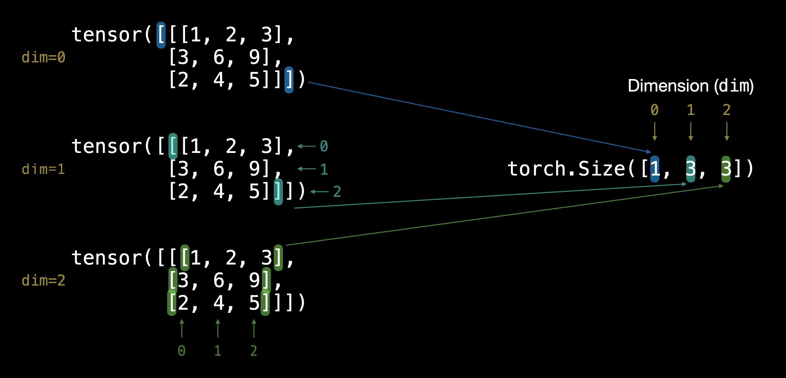
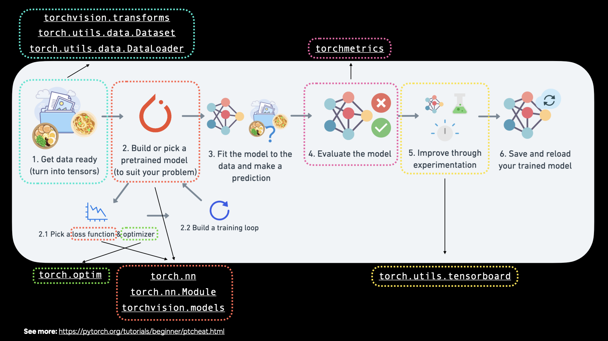
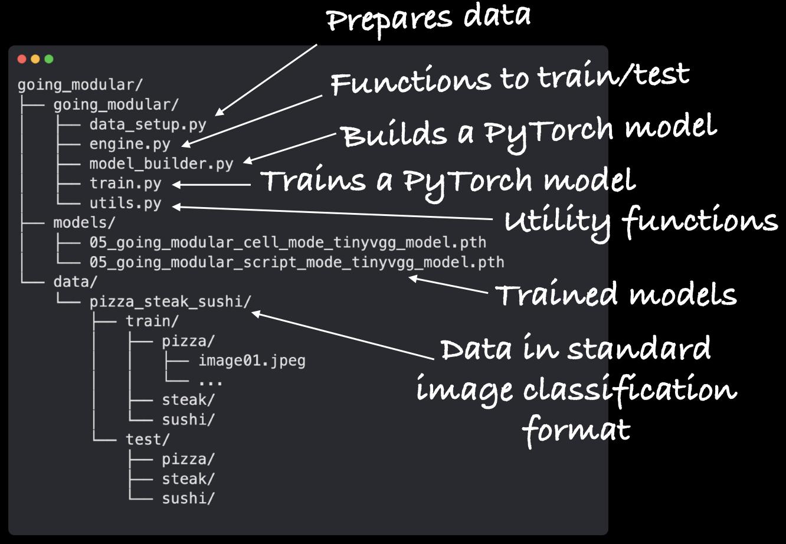
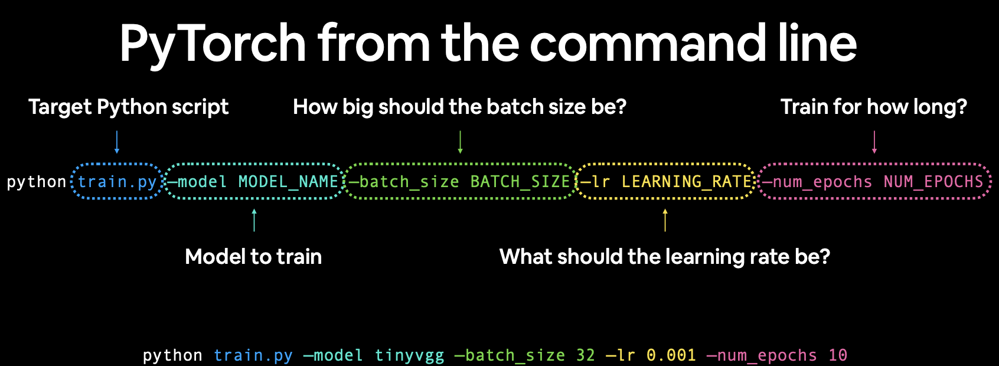
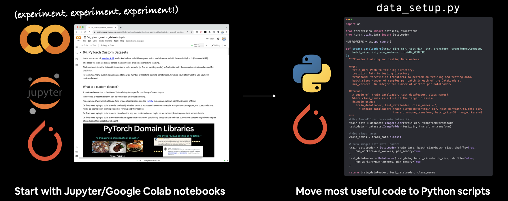
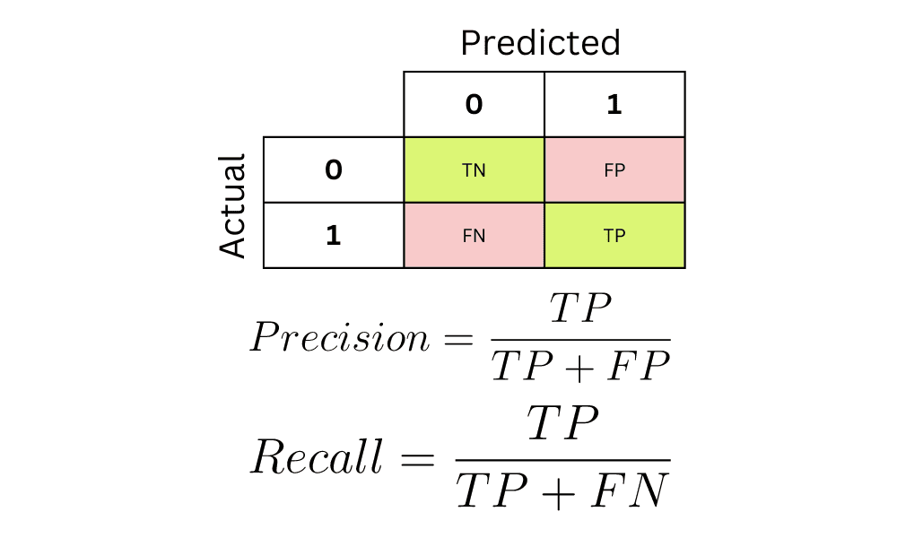

# PyTorch Notes

Some tips / things of notes for myself while I'm learning PyTorch

## What is PyTorch?

PyTorch is an open-source machine learning library widely used in academia and industry for building deep learning models. It offers dynamic computation graphs that provide flexibility and ease in debugging, making it especially suited for research and complex model development. PyTorch accelerates the training of models through efficient computaitons. It seamlessly integrates with GPU for enhanced computational speed, making it ideal for handling large-scale data in AI applications. It is particularly useful in fields like genomics, where understanding patterns in large volumes of data can lead to breakthroughs in understanding complex natural phenomena.


## Running PyTorch

The best place to get started running PyTorch code is with [Google Colab](https://colab.research.google.com/). It is a cloud-based Jupyter notebook environment provided by Google that allows users to write and execute Python code collaboratively in real-time. It comes pre-installed with PyTorch and a bunch of other useful libraries for data science and machine learning and it offers free access to GPUs and TPUs (this access is not guaranteed 24/7 but a lot of time you will be allocated a free device). 

## Tensors

Tensors are mathematical objects that generalize scalars, vectors, and matrices to higher dimensions. They are fundamental objects in linear algebra. 

Tensors are used extensively in various fields, including physics (especially in theories like general relativity and electromagnetism), engineering (for modeling stress and strain in materials), computer science (in machine learning, particularly in deep learning frameworks), and many other areas where multidimensional data needs to be manipulated and analyzed.

All data inputted and outputted out of models in PyTorch need to be represented as tensors.

### Tensor Size, Shape and Dimensions

In PyTorch, it's important to not conflate the concepts of tensor dimensions and tensor size and shape.

The number of dimensions that a tensor has can basically be determined by counting the number of square bracket pairs it has and can be found using `.ndim`

Tensor size and tensor shape are identical. They can be used to figure out the size of *each* dimension individually using `.shape` or `.size()`.

Example:

```python
TENSOR = torch.tensor([[[1, 2, 3],
                        [3, 6, 9],
                        [2, 4, 5]]])

TENSOR.ndim
# Outputs 3

TENSOR.shape
# Outputs torch.Size([1, 3, 3])

TENSOR.size()
# Outputs torch.Size([1, 3, 3])
```

Pictured Example:



### Converting between Numpy arrays and PyTorch tensors

Converting data between NumPy arrays and PyTorch tensors is a routine task. PyTorch tensors are similar to NumPy’s ndarrays, except that tensors can run on GPUs or other hardware accelerators. In fact, tensors and NumPy arrays can often share the same underlying memory, eliminating the need to copy data. There's 2 important difference that you have to remember when converting between the two objects.

1. PyTorch and Numpy have different default data types
    - NumPy arrays typically have a datatype of `float64` for floating-point numbers and `int64` for integers on most systems.
    - PyTorch tensors have a default datatype of `float32`
2. Numpy arrays cannot exist on a GPU, only a CPU, whereas PyTorch tensors can exist on both.

To convert NumPy arrays to PyTorch tensors, use the followings code and tools.

- Data in NumPy, want in PyTorch tensor -> `torch.from_numpy(ndarray)`
- PyTorch tensor, want in NumPy array -> `torch.Tensor.numpy()`
- For type coersion, `torch.from_numpy(ndarray).type(torch.float32)` 
- To convert PyTorch data on GPU to Numpy, use `torch.Tensor.cpu()`

**Note**: NumPy arrays cannot be generated from tensors that require gradient computation. Use `torch.Tensor.detach()` to remove tensors from computatation graphs.

## Device agnostic code

One of the most common errors in deep learning code is encountering a device error with some data or object in code. For example, you could try to multiply a tensor on a CPU with a tensor on a GPU and these two tensors will not be able to *find each other*, resulting in an error. 

Good machine learning code should never run into this error because the code should be **device agnostic**. To set up device agnostic code, write this code near the top of your script

```python
# Set up device agnostic code
device = "cuda" if torch.cuda.is_available() else "cpu"
print(f"Using device: {device}")
```

Then when you want to set the device attribute on piece of data or model, write 

```python
torch.Tensor.to(device)
```

This will ensure all data is on the same device, especially if a GPU is not available.

**Note:** If you are working with NumPy data, that data can only exist on a CPU. If a GPU is available and PyTorch data is sent to the GPU, you can still encounter device errors when working with these two types of data. Use `torch.Tensor.cpu()` on NumPy data to fix this.

### Figuring out if you're on a GPU

To check if you're running on a GPU in Google Collab, you can run

```python
torch.cuda.is_available()
```

which will return `true` or `false` based on whether or not you are on a GPU

If a GPU is available, you can check details for it using the following command in Google Colab

```bash
!nvidia-smi
```

which will output something like this if you are running on a GPU

```
Wed Mar 27 13:41:05 2024       
+---------------------------------------------------------------------------------------+
| NVIDIA-SMI 535.104.05             Driver Version: 535.104.05   CUDA Version: 12.2     |
|-----------------------------------------+----------------------+----------------------+
| GPU  Name                 Persistence-M | Bus-Id        Disp.A | Volatile Uncorr. ECC |
| Fan  Temp   Perf          Pwr:Usage/Cap |         Memory-Usage | GPU-Util  Compute M. |
|                                         |                      |               MIG M. |
|=========================================+======================+======================|
|   0  Tesla T4                       Off | 00000000:00:04.0 Off |                    0 |
| N/A   33C    P8               9W /  70W |      3MiB / 15360MiB |      0%      Default |
|                                         |                      |                  N/A |
+-----------------------------------------+----------------------+----------------------+
                                                                                         
+---------------------------------------------------------------------------------------+
| Processes:                                                                            |
|  GPU   GI   CI        PID   Type   Process name                            GPU Memory |
|        ID   ID                                                             Usage      |
|=======================================================================================|
|  No running processes found                                                           |
+---------------------------------------------------------------------------------------+
```

## Creating a machine learning model in PyTorch

Creating a model follows the following blueprint


The first line declares a class with whatever name you want for your model and that inherits from `nn.Module`. This is the base class for all neural network modules in PyTorch. 

The constructor function (`def __init__(self):`) is called every time you create an instance of the class. Inside the constructor, `super().__init__()` is called. This line calls the constructor of the superclass (`nn.Module`). 
In Python, `super()` is a built-in function that returns a proxy object that delegates method calls to a parent or superclass.

When you call `super().__init__()`, you are essentially calling the constructor (`__init__` method) of the superclass, which in this case is `nn.Module`. This line initializes the superclass, ensuring that any necessary setup defined in the superclass's constructor is executed before initializing the current class. 

By calling `super().__init__()`, you ensure that the subclass inherits all the attributes and methods of the superclass, which is essential for the proper functioning of the subclass and initialize the neural network module.

### the `forward` method

The `forward` method in a PyTorch `nn.Module` subclass defines the computation performed when the module is called with input data. This method outlines how input data flows through the network's layers to produce an output (defines the forward computation of the model). It ***must*** be overwritten for any class that inherits from `nn.Module` in order for the model to work (otherwise the model doesn't know how to pass the data through the layers).

## `nn.Module` and the `forward` method


(IMG_4323.PNG)

## Loss functions
- BCEWithLogitsLoss() # Binary classification
    - Combines sigmoid activation function with BCELoss. Better than BCELoss because more numerically stable

## Running a train/test loop

### `optimizer.zero_grad()`

`optimizer.zero_grad()` is used to clear the gradients of all optimized tensors. Here's why it's necessary:

**Accumulation of Gradients**: During the backward pass, gradients are computed and accumulated in the `.grad` attribute of each parameter tensor. If you don't zero the gradients before the next backward pass, the new gradients will be added to the existing ones, leading to incorrect gradient values.

**Preventing Gradient Accumulation**: In many cases, you want to compute gradients for each batch of data separately. If you accumulate gradients across multiple batches, it effectively results in a larger batch size, which can lead to less stable training and divergence of the optimization process.

**Efficiency**: Zeroing the gradients also helps in memory efficiency. By clearing the gradients after each optimization step, you free up memory that would otherwise be occupied by the gradients of previous batches.

`optimizer.zero_grad()` ensures that you start each optimization step with fresh gradients, avoiding gradient accumulation issues and improving training stability and efficiency. It's an essential step in the training loop when using gradient-based optimization algorithms like stochastic gradient descent (SGD), Adam, etc.

### `optimizer.step()`

When you call the `.step()` function on an optimizer in PyTorch, it performs a single optimization step. Here's what happens during this step:

**Gradient Computation**: If you've previously performed a backward pass (by calling the `backward()` function on the loss tensor), gradients have been computed for all parameters that have `requires_grad=True`. These gradients are stored in the `.grad` attribute of each parameter tensor.

**Parameter Update**: The optimizer uses these computed gradients to update the parameters. The update rule depends on the optimization algorithm being used. For example, in stochastic gradient descent (SGD), the update rule for a parameter 


gradients to update the parameters. The update rule depends on the optimization algorithm being used. For example, in stochastic gradient descent (SGD), the update rule for a parameter $\theta$ is:

$$\theta_{\text {new }}=\theta_{\text {old }}- \text {learning-rate} \times \text{gradient}$$

The learning rate controls the step size of the update. Other optimization algorithms like Adam, Adagrad, etc., have more sophisticated update rules.

**Gradient Clearing**: After the parameter update, the gradients are cleared for the next iteration. This prevents gradients from accumulating across multiple `backward()` calls.

Calling `optimizer.step()` thus iterates through all the parameters registered with the optimizer, updates them according to their respective gradients and the optimization algorithm's update rule, and clears the gradients for the next iteration. This process is central to the training loop of a neural network, where parameters are iteratively updated to minimize the loss function and improve the model's performance.


## Saving a model 


### Loading a model

## PyTorch important tools and libraries

One of the benefits of Google Colab is that it comes pre-installed wiht a lot of useful PyTorch tools that help out with different parts of the workflow. 

Some of them are listed here



## Working with Images in PyTorch

Working with images is a common practice in deep learning. Even if the data you're working with aren't necessarily image data, sometimes converting that data into an image interpretation first can be a useful.

Below is a list of PyTorch computer vision libraries you should be aware of.

|PyTorch module|What does it do?|
|:----|:----|
|[`torchvision`](https://pytorch.org/vision/stable/index.html)|Contains datasets, model architectures and image transformations often used for computer vision problems.|
|[`torchvision.datasets`](https://pytorch.org/vision/stable/datasets.html)|Here you'll find many example computer vision datasets for a range of problems from image classification, object detection, image captioning, video classification and more. It also contains [a series of base classes for making custom datasets](https://pytorch.org/vision/stable/datasets.html#base-classes-for-custom-datasets).|
|[`torchvision.models`](https://pytorch.org/vision/stable/models.html)|This module contains well-performing and commonly used computer vision model architectures implemented in PyTorch, you can use these with your own problems.|
|[`torchvision.transforms`](https://pytorch.org/vision/stable/transforms.html)|Often images need to be transformed (turned into numbers/processed/augmented) before being used with a model, common image transformations are found here.|
|[`torch.utils.data.Dataset`](https://pytorch.org/docs/stable/data.html#torch.utils.data.Dataset)|Base dataset class for PyTorch.|
|[`torch.utils.data.DataLoader`](https://pytorch.org/docs/stable/data.html#module-torch.utils.data)|Creates a Python iterable over a dataset (created with `torch.utils.data.Dataset`).|

Preset datasets can be grabbed from `torchvision.datasets`. [See here for more information](https://www.learnpytorch.io/03_pytorch_computer_vision/#1-getting-a-dataset).

## Image dimensions in PyTorch

Images typically have 3 dimensions: Height (`H`), Width(`W`), and Colour Channels (`C`).

There's debate on whether images should be represented as `CHW` (color channels first) or `HWC` (color channels last).

**Note**: You'll also see `NCHW` and `NHWC` formats where `N` stands for number of images. For example if you have a `batch_size=32`, your tensor shape may be `[32, 1, 28, 28]`. 

PyTorch generally accepts `NCHW` (channels first) as the default for many operators.

However, PyTorch also explains that `NHWC` (channels last) performs better and is considered [best practice](https://pytorch.org/blog/tensor-memory-format-matters/#pytorch-best-practice).

The dimensions of a tensor can be easily rearranged with the `torch.permute()` function

Example:

```python
import torch

# Create a tensor of shape [32, 1, 28, 28]
tensor = torch.randn(32, 1, 28, 28)

# Use the permute function to reorder the dimensions
permuted_tensor = tensor.permute(0, 2, 3, 1)

# Print the shape of the permuted tensor
print(permuted_tensor.shape)
# Outputs: torch.Size([32, 28, 28, 1])
```

## Using Tensors with Matplotlib

Matplotlib is a Python library used for generating plots, charts, histograms, and other graphical representations of data. It's very useful for working with images in order to visualize the tensor representations of images to make sure the images are correct (using the `matplotlib.pyplot.imshow` method)

In order to pass a tensor into Matplotlib it's important to know two things.

- Matplotlib takes it's input as NumPy arrays
- NumPy arrays cannot be generated from tensors that require gradient computation

To this end, the method `torch.Tensor.detach()` can help.

In PyTorch, `torch.Tensor.detach()` is a method used to detach a tensor from the computation graph. When you perform operations on tensors in PyTorch, the computational graph is built to keep track of the operations applied to tensors, which is essential for automatic differentiation during backpropagation.

However, sometimes you may want to work with tensors outside of the computational graph, such as when you want to stop gradients from being calculated with respect to a particular tensor. This is where `torch.Tensor.detach()` comes in handy.

When you call `torch.Tensor.detach()` on a tensor, it creates a new tensor that shares the same data but is detached from the computation graph. This means that gradients will not be calculated with respect to this tensor, and it will not be part of the computation graph for future operations.

This tensor can then be converted to a NumPy array using `torch.Tensor.numpy()`. You can also call `torch.Tensor.cpu()` beforehand to be safe because NumPy data can only exist on a CPU.

For example:

```python
import torch
import matplotlib.pyplot as plt

# Generate a random 64 x 64 image with 3 colour channels
EXAMPLE_IMAGE_TENSOR = torch.randn(64, 64, 3)

# Plot the image that the underlying tensor represents
plt.imshow(EXAMPLE_IMAGE_TENSOR.detach().cpu().numpy()) # Notice the detaching and conversion
```

## Inspecting datasets

Datasets from the `datasets` library come a a dataset object. Even if you convert them to tensors using 
the `ToTensor` transform, you still won't be able to operate on the tensor unless you know how to isolate the tensor. 


```python
# Import PyTorch
import torch
from torch import nn
from torch.utils.data import Dataset, DataLoader

# Import torchvision
import torchvision
from torchvision import datasets
from torchvision.transforms import ToTensor

# Import MNIST dataset
# Import training data
train_data = datasets.MNIST(
    root = "data", # where to download the data to?
    train = True, # Get the training data
    download = True, # Download the data if it doesn't exist on the dist
    transform = ToTensor(), # Transform the images into tensors. Default is PIL format
    target_transform = None # You can transform the labels as well
    )


print(train_data)
"""Outputs
Dataset MNIST
    Number of datapoints: 60000
    Root location: data
    Split: Train
    StandardTransform
Transform: ToTensor()
"""

print(str(train_data.__class__.mro()).replace(",", "\n"))
"""Outputs
[<class 'torchvision.datasets.mnist.MNIST'>
 <class 'torchvision.datasets.vision.VisionDataset'>
 <class 'torch.utils.data.dataset.Dataset'>
 <class 'typing.Generic'>
 <class 'object'>]
"""

print(train_data[0])
"""Outputs
(tensor([[[0.0000, 0.0000, 0.0000, 0.0000, 0.0000, 0.0000, 0.0000, 0.0000,
          ... truncated output to save space ...
          0.0000, 0.0000, 0.0000, 0.0000]]]), 5)
"""
# ^ The "5" at the end is the label. This is a tuple of a tensor and an integer

print(str(train_data[0].__class__.mro()).replace(",", "\n"))
"""Outputs
[ <class 'tuple'>
 <class 'object'>]
"""

print(train_data[0][0])
"""Outputs
tensor([[[0.0000, 0.0000, 0.0000, 0.0000, 0.0000, 0.0000, 0.0000, 0.0000,
          ... truncated output to save space ...
          0.0000, 0.0000, 0.0000, 0.0000]]])
"""

print(str(train_data[0][0].__class__.mro()).replace(",", "\n"))
"""Outputs
[<class 'torch.Tensor'>
 <class 'torch._C.TensorBase'>
 <class 'object'>]
"""

# ^ Now a tensor is isolated from the dataset and ready to be inspected
```

### DataLoaders

Once you a dataset ready to go, the next step is to prepare it with a `torch.utils.data.DataLoader` or `DataLoader` for short.

The `DataLoader` helps load data into a model for training and for inference. It turns a large Dataset into a Python iterable of smaller chunks. These smaller chunks are called **batches** or **mini-batches** and can be set by the `batch_size` parameter. It's good to do this because:

1. It's more computationally efficient. In an ideal world you could do the forward pass and backward pass across all of your data at once. But once you start using really large datasets, unless you've got infinite computing power, it's easier to break them up into batches.

2. It also gives your model more opportunities to improve. With mini-batches (small portions of the data), gradient descent is performed more often per epoch (once per mini-batch rather than once per epoch).

32 is often a good is a good place to start in terms of batch size for a fair amount of problems. But since this is a value you can set (a hyperparameter) you can try all different kinds of values, though generally powers of 2 are used most often (e.g. 32, 64, 128, 256, 512).

DataLoaders can be created as follows:

```python
from torch.utils.data import DataLoader

# Setup the batch size hyperparameter
BATCH_SIZE = 32

# Turn datasets into iterables (batches)
train_dataloader = DataLoader(train_data, # dataset to turn into iterable
    batch_size=BATCH_SIZE, # how many samples per batch? 
    shuffle=True # shuffle data every epoch?
)

test_dataloader = DataLoader(test_data,
    batch_size=BATCH_SIZE,
    shuffle=False # don't necessarily have to shuffle the testing data
)

# Let's check out what we've created
print(f"Dataloaders: {train_dataloader, test_dataloader}") 
print(f"Length of train dataloader: {len(train_dataloader)} batches of {BATCH_SIZE}")
print(f"Length of test dataloader: {len(test_dataloader)} batches of {BATCH_SIZE}")

"""Outputs
Dataloaders: (<torch.utils.data.dataloader.DataLoader object at 0x7fc991463cd0>, <torch.utils.data.dataloader.DataLoader object at 0x7fc991475120>)
Length of train dataloader: 1875 batches of 32
Length of test dataloader: 313 batches of 32
"""
```

### Getting the data out of DataLoaders

You can use  `next(iter(DATALOADER_OBJECT))`, to get your data out of dataloaders

Example:

```python
train_features_batch, train_labels_batch = next(iter(train_dataloader))
```

1. `train_dataloader` is an iterable object (likely a `DataLoader` instance) containing batches of training data.
2. `iter(train_dataloader)` creates an iterator from `train_dataloader`, allowing us to iterate over its batches.
3. `next(...)` retrieves the next batch from the iterator.
4. `train_features_batch, train_labels_batch` unpacks the features (input data) and labels from the retrieved batch.

Overall, this line of code fetches the next batch of training data and separates it into features and labels, assigning them to the variables `train_features_batch` and `train_labels_batch`, respectively. This is often used in training loops to iterate over batches of data for model training.


## Organising PyTorch projects

Once you have a machine learning project that you want to save, it may be a good idea to organize it into modules. 



You may want the model to be launched from a command line executable. 



Notebooks are fantastic for iteratively exploring and running experiments quickly.

However, for larger scale projects you may find Python scripts more reproducible and easier to run.

There's arguments for both sides.

| |**Pros**|**Cons**|
|:----|:----|:----|
|**Notebooks**|Easy to experiment/get started|Versioning can be hard|
| |Easy to share (e.g. a link to a Google Colab notebook)|Hard to use only specific parts|
| |Very visual|Text and graphics can get in the way of code|
| | 
|**Python scripts**|Can package code together (saves rewriting similar code across different notebooks)|Experimenting isn't as visual (usually have to run the whole script rather than one cell)|
| |Can use git for versioning| |
| |Many open source projects use scripts| |
| |Larger projects can be run on cloud vendors (not as much support for notebooks)| |

In anycase, a good workflow is to start on Google Colab and move important code to scripts if you would like



### Jupyter cell magic commands

Jupyter cell magic commands are special commands that can be used in Jupyter notebooks to perform various tasks or change the behavior of code cells. These commands are preceded by one or two percent signs (`%` or `%%`) and are often used to streamline common tasks, interact with the notebook environment, or access system-level functionalities.

A very useful magic command to help convert the code in the code cell into a script is the `%%writefile` command. It's used as follows:

```
%%writefile DIR_NAME/SCRIPT_NAME.py

# Your Python code goes here
```

Executing this code cell will write all the code in the code cell into a script in the provided path.


## `model.parameters` vs `model.state_dict`


## `model.train()`, `model.eval()`, and `torch.inference_mode()` 

## Random Seeds 

Random seeds can be set before generating random data to ensure reproducibility, however setting manual seeds for random number generators in deep learning frameworks like PyTorch or TensorFlow is not generally recommended, because you want to make sure that the parameters your model learns are similar regardless of what random weights and biases they started with. However, if you do want to set random seeds, there are a few things you should know

You can set a random seed using 
```python
RANDOM_SEED = 42
torch.manual_seed(RANDOM_SEED)
```

However be aware that random seeds aren't applied to every random generation in the code.

Example:

```python
# Let's make some random but reproducible tensors
import torch

# Set the random seed
RANDOM_SEED = 42
torch.manual_seed(RANDOM_SEED) # SEED SET

# Generate random tensors
random_tensor_A = torch.rand(3,4)
random_tensor_B = torch.rand(3, 4)

# Print random tensors
print(random_tensor_A)
print(random_tensor_B)

# Check if random tensors are equal
print(random_tensor_A == random_tensor_B)
```

Outputs

```
tensor([[0.8823, 0.9150, 0.3829, 0.9593],
        [0.3904, 0.6009, 0.2566, 0.7936],
        [0.9408, 0.1332, 0.9346, 0.5936]])
tensor([[0.8694, 0.5677, 0.7411, 0.4294],
        [0.8854, 0.5739, 0.2666, 0.6274],
        [0.2696, 0.4414, 0.2969, 0.8317]])
tensor([[False, False, False, False],
        [False, False, False, False],
        [False, False, False, False]])
```

To fix this issue, keep setting the same random seed before every random generation.

Example

```python
# Let's make some random but reproducible tensors
import torch

# Set the random seed
RANDOM_SEED = 42

# Generate random tensors
torch.manual_seed(RANDOM_SEED) # FIRST SEED SET
random_tensor_A = torch.rand(3,4)

torch.manual_seed(RANDOM_SEED) # SECOND SEED SET
random_tensor_B = torch.rand(3, 4)

# Print random tensors
print(random_tensor_A)
print(random_tensor_B)

# Check if random tensors are equal
print(random_tensor_A == random_tensor_B)
```

Outputs

```
tensor([[0.8823, 0.9150, 0.3829, 0.9593],
        [0.3904, 0.6009, 0.2566, 0.7936],
        [0.9408, 0.1332, 0.9346, 0.5936]])
tensor([[0.8823, 0.9150, 0.3829, 0.9593],
        [0.3904, 0.6009, 0.2566, 0.7936],
        [0.9408, 0.1332, 0.9346, 0.5936]])
tensor([[True, True, True, True],
        [True, True, True, True],
        [True, True, True, True]])
```

Additionally, if you want to set the manual seed on a GPU, use

```python
torch.cuda.manual_seed(seed)
```

## Multiples of 8

Multiples of 8 are often recommended for machine learning, particularly in neural network architectures, due to their compatibility with hardware optimizations, specifically related to parallel processing and memory alignment. You should strive to use as many multiples of 8 (i.e. 8, 16, 32, 64, 128, 256, etc.) for hyperparameters such as number of units in hidden layers, batch sizes, etc.

### Minibatches, multiples of 8, and not going higher than 32

Mini-batches are subsets of a dataset used during the training process of machine learning models, particularly in deep learning. Instead of feeding the entire dataset into the model at once, mini-batch training involves dividing the dataset into smaller batches and processing each batch sequentially during training. 

In that same vain as above, minibatches should also be set to multiples of 8, but also it is often recommended to use minibatches of [around 32](https://arxiv.org/abs/1804.07612), especially when first starting building your model, as this strikes a balance between utilizing GPU memory efficiently and allowing for a reasonable training speed.

## SciKitLearn train/test split

## TorchMetrics

TorchMetrics is a library in PyTorch specifically designed for efficient metrics computation in machine learning and deep learning tasks. It provides a wide range of metrics commonly used for evaluating model performance during training and validation. Some of these include:

|**Metric name/Evaluation method**|**Defintion**|**Code**|
|:----|:----|:----|
|Accuracy|Out of 100 predictions, how many does your model get correct? E.g. 95% accuracy means it gets 95/100 predictions correct.|[`torchmetrics.Accuracy()`](https://torchmetrics.readthedocs.io/en/stable/classification/accuracy.html#id3) or [`sklearn.metrics.accuracy_score()`](https://scikit-learn.org/stable/modules/generated/sklearn.metrics.accuracy_score.html)|
|Precision|Proportion of true positives over total number of samples. Higher precision leads to less false positives (model predicts 1 when it should've been 0).|[`torchmetrics.Precision()`](https://torchmetrics.readthedocs.io/en/stable/classification/precision.html#id4) or [`sklearn.metrics.precision_score()`](https://scikit-learn.org/stable/modules/generated/sklearn.metrics.precision_score.html)|
|Recall|Proportion of true positives over total number of true positives and false negatives (model predicts 0 when it should've been 1). Higher recall leads to less false negatives.|[`torchmetrics.Recall()`](https://torchmetrics.readthedocs.io/en/stable/classification/recall.html#id5) or [`sklearn.metrics.recall_score()`](https://scikit-learn.org/stable/modules/generated/sklearn.metrics.recall_score.html)|
|F1-score|Combines precision and recall into one metric. 1 is best, 0 is worst.|[`torchmetrics.F1Score()`](https://torchmetrics.readthedocs.io/en/stable/classification/f1_score.html#f1score) or [`sklearn.metrics.f1_score()`](https://scikit-learn.org/stable/modules/generated/sklearn.metrics.f1_score.html)|
|[Confusion matrix](https://www.dataschool.io/simple-guide-to-confusion-matrix-terminology/)|Compares the predicted values with the true values in a tabular way, if 100% correct, all values in the matrix will be top left to bottom right (diagnol line).|[`torchmetrics.ConfusionMatrix`](https://torchmetrics.readthedocs.io/en/stable/classification/confusion_matrix.html#confusionmatrix) or [`sklearn.metrics.plot_confusion_matrix()`](https://scikit-learn.org/stable/modules/generated/sklearn.metrics.ConfusionMatrixDisplay.html#sklearn.metrics.ConfusionMatrixDisplay.from_predictions)|
|Classification report|Collection of some of the main classification metrics such as precision, recall and f1-score.|[`sklearn.metrics.classification_report()`](https://scikit-learn.org/stable/modules/generated/sklearn.metrics.classification_report.html)|

### Installing and Using TorchMetrics

TorchMetrics *does not come pre-intstalled on Google Colab*, therefore you have to manually install it. Additionally, it is important to remember *send your accuracy model to your target device* in order for it to be able to interact with your data.

The following template code shows how to install and use TorchMetrics:

```python
try:
    from torchmetrics import Accuracy
except:
    !pip install torchmetrics
    from torchmetrics import Accuracy

# Setup metric and make sure it's on the target device
torchmetrics_accuracy = Accuracy(task='multiclass', num_classes=4).to(device)

# Calculate accuracy
torchmetrics_accuracy(y_preds, y_test)
```

### Precision vs Recall

Precision and recall are two important metrics used to evaluate the performance of classification models, especially in situations where there is class imbalance. They are often used together to provide a more comprehensive understanding of a model's performance.



- **Precision**:
  - Precision measures the accuracy of positive predictions made by the model.
  - It is calculated as the ratio of true positive predictions to the total number of positive predictions made by the model, regardless of whether they are correct or incorrect.
  - Precision focuses on minimizing false positives, meaning it measures how many of the predicted positive instances are actually true positives.

- **Recall**:
  - Recall measures the ability of the model to capture all the positive instances in the dataset.
  - It is calculated as the ratio of true positive predictions to the total number of actual positive instances in the dataset.
  - Recall focuses on minimizing false negatives, meaning it measures how many of the true positive instances are captured by the model.
- Trade-off:
  - Precision and recall often have an inverse relationship. Improving precision typically reduces recall and vice versa.
  - The choice between precision and recall depends on the specific requirements of the problem. For example, in applications where false positives are costly (e.g., medical diagnosis), precision may be prioritized. In contrast, in applications where false negatives are more critical (e.g., detecting fraud), recall may be prioritized.
  - **F1 Score**, the harmonic mean of precision and recall, is commonly used to balance the trade-off between the two metrics.

Precision and recall provide complementary insights into the performance of a classification model, helping to assess its ability to make correct positive predictions and capture all positive instances in the dataset.

## `torch.utils.data.DataSet` and `torch.utils.data.DataLoader`

## `timeit`

`from timeit import default_timer as timer`

## tqdm

```python
from tqdm.auto import tqdm
for i in tqdm(range(10000)):
    ...
```

## Transfer learning 

Transfer learning is a machine learning technique where a model trained on one task is adapted or transferred to a related but different task. Instead of training a model from scratch, transfer learning leverages knowledge gained from solving one problem to help solve a different but related problem. This approach is particularly useful when working with limited data or computational resources and can significantly reduce training time and improve performance.

Often times machine learning architects will start a new data science project by using another trained model as a backbone and modifying it for their purpose 

### "Freezing" and "Unfreezing"

### Resources for finding pre-trained models 

|**Location**|**What's there?**|**Link(s)**|
|:----|:----|:----|
|**PyTorch domain libraries**|Each of the PyTorch domain libraries (`torchvision`, `torchtext`) come with pretrained models of some form. The models there work right within PyTorch.|[`torchvision.models`](https://pytorch.org/vision/stable/models.html), [`torchtext.models`](https://pytorch.org/text/main/models.html), [`torchaudio.models`](https://pytorch.org/audio/stable/models.html), [`torchrec.models`](https://pytorch.org/torchrec/torchrec.models.html)|
|**HuggingFace Hub**|A series of pretrained models on many different domains (vision, text, audio and more) from organizations around the world. There's plenty of different datasets too.|https://huggingface.co/models, https://huggingface.co/datasets|
|**`timm` (PyTorch Image Models) library**|Almost all of the latest and greatest computer vision models in PyTorch code as well as plenty of other helpful computer vision features.|https://github.com/rwightman/pytorch-image-models|
|**Paperswithcode**|A collection of the latest state-of-the-art machine learning papers with code implementations attached. You can also find benchmarks here of model performance on different tasks.|https://paperswithcode.com/|

## Experiment tracking

If you're running lots of different experiments, experiment tracking helps you figure out what works and what doesn't.


Why track experiments?
If you're only running a handful of models (like we've done so far), it might be okay just to track their results in print outs and a few dictionaries.

However, as the number of experiments you run starts to increase, this naive way of tracking could get out of hand. So if you keep experimenting with models you'll want a way to track them.

There are as many different ways to track machine learning experiments as there is experiments to run.

This table covers a few.

|**Method**|**Setup**|**Pros**|**Cons**|**Cost**|
|:----|:----|:----|:----|:----|
|Python dictionaries, CSV files, print outs|None|Easy to setup, runs in pure Python|Hard to keep track of large numbers of experiments|Free|
|[TensorBoard](https://www.tensorflow.org/tensorboard/get_started)|Minimal, install [`tensorboard`](https://pypi.org/project/tensorboard/)|Extensions built into PyTorch, widely recognized and used, easily scales.|User-experience not as nice as other options.|Free|
|[Weights & Biases Experiment Tracking](https://wandb.ai/site/experiment-tracking)|Minimal, install [`wandb`](https://docs.wandb.ai/quickstart), make an account|Incredible user experience, make experiments public, tracks almost anything.|Requires external resource outside of PyTorch.|Free for personal use|
|[MLFlow](https://mlflow.org/)|Minimal, install `mlflow` and starting tracking|Fully open-source MLOps lifecycle management, many integrations.|Little bit harder to setup a remote tracking server than other services.|Free|

### TensorBoard

TensorBoard is a part of the TensorFlow deep learning library and is an excellent way to visualize different parts of your model.

### Creating Tensorboard compatible files

We can use PyTorch's `torch.utils.tensorboard.SummaryWriter()` class to save various parts of our model's training progress to file.

By default, the `SummaryWriter()` class saves various information about our model to a file set by the `log_dir` parameter.

The default location for `log_dir` is under `runs/CURRENT_DATETIME_HOSTNAME`, where the `HOSTNAME` is the name of your computer. You can change where your experiments are tracked and customize the filename as you'd like.

The outputs of the `SummaryWriter()` are saved in TensorBoard format, which makes them compatible with the TensorBoard display.

## Extra Resources

- [To help understand CNN's](https://poloclub.github.io/cnn-explainer/)
- [To help understand Transformers](https://jalammar.github.io/illustrated-transformer/)

## Adding batch dimensions

with `.unsqueeze()`


## `requires_grad()`