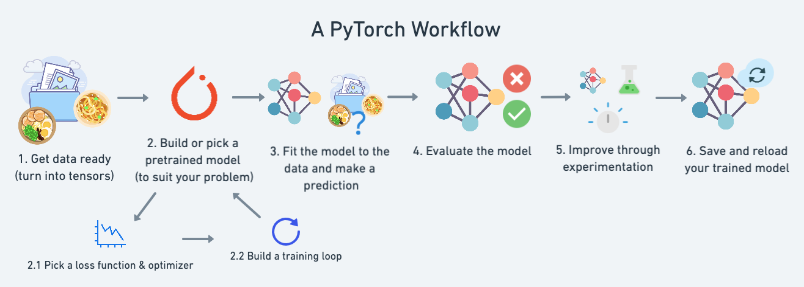
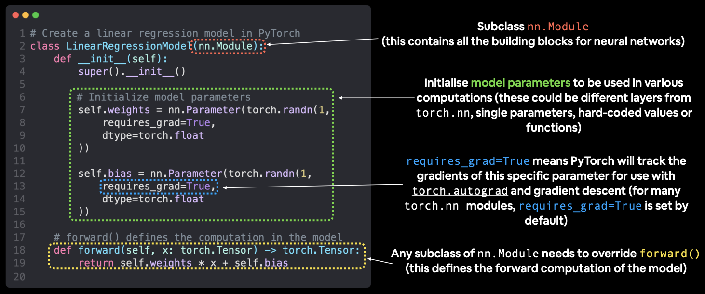

# PyTorch Notes

Some tips / things of notes for myself while I'm learning PyTorch

## What is PyTorch?

PyTorch is an open-source machine learning library widely used in academia and industry for building deep learning models. It offers dynamic computation graphs that provide flexibility and ease in debugging, making it especially suited for research and complex model development. PyTorch accelerates the training of models through efficient computaitons. It seamlessly integrates with GPU for enhanced computational speed, making it ideal for handling large-scale data in AI applications. It is particularly useful in fields like genomics, where understanding patterns in large volumes of data can lead to breakthroughs in understanding complex natural phenomena.



## Running PyTorch

## Tensors

Tensors are mathematical objects that generalize scalars, vectors, and matrices to higher dimensions. They are fundamental objects in linear algebra. 

Tensors are used extensively in various fields, including physics (especially in theories like general relativity and electromagnetism), engineering (for modeling stress and strain in materials), computer science (in machine learning, particularly in deep learning frameworks), and many other areas where multidimensional data needs to be manipulated and analyzed.

All data inputted and outputted out of models in PyTorch need to be represented as tensors.

### Converting between Numpy arrays and PyTorch tensors

Converting data between NumPy arrays and PyTorch tensors is a routine task. PyTorch tensors are similar to NumPy’s ndarrays, except that tensors can run on GPUs or other hardware accelerators. In fact, tensors and NumPy arrays can often share the same underlying memory, eliminating the need to copy data. There's 2 important difference that you have to remember when converting between the two objects.

1. PyTorch and Numpy have different default data types
    - NumPy arrays typically have a datatype of `float64` for floating-point numbers and `int64` for integers on most systems.
    - PyTorch tensors have a default datatype of `float32`
2. Numpy arrays cannot exist on a GPU, only a CPU, whereas PyTorch tensors can exist on both.

To convert NumPy arrays to PyTorch tensors, use the followings code and tools.

- Data in NumPy, want in PyTorch tensor -> `torch.from_numpy(ndarray)`
- PyTorch tensor, want in NumPy array -> `torch.Tensor.numpy()`
- For type coersion, `torch.from_numpy(ndarray).type(torch.float32)` 
- To convert PyTorch data on GPU to Numpy, use `Tensor.cpu()`


## Random Seeds 

Random seeds can be set before generating random data to ensure reproducibility, however setting manual seeds for random number generators in deep learning frameworks like PyTorch or TensorFlow is not generally recommended, because you want to make sure that the parameters your model learns are similar regardless of what random weights and biases they started with. However, if you do want to set random seeds, there are a few things you should know

You can set a random seed using 
```python
RANDOM_SEED = 42
torch.manual_seed(RANDOM_SEED)
```

However be aware that random seeds aren't applied to every random generation in the code.

Example:

```python
# Let's make some random but reproducible tensors
import torch

# Set the random seed
RANDOM_SEED = 42
torch.manual_seed(RANDOM_SEED) # SEED SET

# Generate random tensors
random_tensor_A = torch.rand(3,4)
random_tensor_B = torch.rand(3, 4)

# Print random tensors
print(random_tensor_A)
print(random_tensor_B)

# Check if random tensors are equal
print(random_tensor_A == random_tensor_B)
```

Outputs

```
tensor([[0.8823, 0.9150, 0.3829, 0.9593],
        [0.3904, 0.6009, 0.2566, 0.7936],
        [0.9408, 0.1332, 0.9346, 0.5936]])
tensor([[0.8694, 0.5677, 0.7411, 0.4294],
        [0.8854, 0.5739, 0.2666, 0.6274],
        [0.2696, 0.4414, 0.2969, 0.8317]])
tensor([[False, False, False, False],
        [False, False, False, False],
        [False, False, False, False]])
```

To fix this issue, keep setting the same random seed before every random generation.

Example

```python
# Let's make some random but reproducible tensors
import torch

# Set the random seed
RANDOM_SEED = 42

# Generate random tensors
torch.manual_seed(RANDOM_SEED) # FIRST SEED SET
random_tensor_A = torch.rand(3,4)

torch.manual_seed(RANDOM_SEED) # SECOND SEED SET
random_tensor_B = torch.rand(3, 4)

# Print random tensors
print(random_tensor_A)
print(random_tensor_B)

# Check if random tensors are equal
print(random_tensor_A == random_tensor_B)
```

Outputs

```
tensor([[0.8823, 0.9150, 0.3829, 0.9593],
        [0.3904, 0.6009, 0.2566, 0.7936],
        [0.9408, 0.1332, 0.9346, 0.5936]])
tensor([[0.8823, 0.9150, 0.3829, 0.9593],
        [0.3904, 0.6009, 0.2566, 0.7936],
        [0.9408, 0.1332, 0.9346, 0.5936]])
tensor([[True, True, True, True],
        [True, True, True, True],
        [True, True, True, True]])
```

## Device agnostic code

One of the most common errors in deep learning code is encountering a device error with some data or object in code. For example, you could try to multiply a tensor on a CPU with a tensor on a GPU and these two tensors will not be able to *find each other*, resulting in an error. 

Good machine learning code should never run into this error because the code should be **device agnostic**. To set up device agnostic code, write this code near the top of your script

```python
# Set up device agnostic code
device = "cuda" if torch.cuda.is_available() else "cpu"
print(f"Using device: {device}")
```

Then when you want to set the device attribute on piece of data or model, write 

```python
torch.Tensor.to(device)
```

This will ensure all data is on the same device, especially if a GPU is not available.

**Note:** If you are working with NumPy data, that data can only exist on a CPU. If a GPU is available and PyTorch data is sent to the GPU, you can still encounter device errors when working with these two types of data. Use `torch.Tensor.cpu()` on NumPy data to fix this.

## Creating a machine learning model in PyTorch


## `nn.Module` and the `forward` method
(IMG_4323.PNG)

## Loss functions
- BCEWithLogitsLoss() # Binary classification
    - Combines sigmoid activation function with BCELoss. Better than BCELoss because more numerically stable

## `model.parameters` vs `model.state_dict`


## `model.train()`, `model.eval()`, and `torch.inference_mode()` 

## Minibatches, multiples of 8, and not going higher than 32

## Multiples of 8

## SciKitLearn train/test split

## TorchMetrics

## `torch.utils.data.DataSet` and `torch.utils.data.DataLoader`

## `timeit`

`from timeit import default_timer as timer`

## tqdm

```python
from tqdm.auto import tqdm
for i in tqdm(range(10000)):
    ...
```