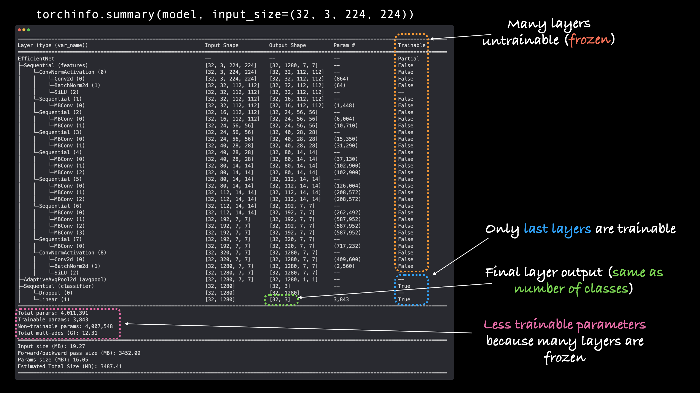
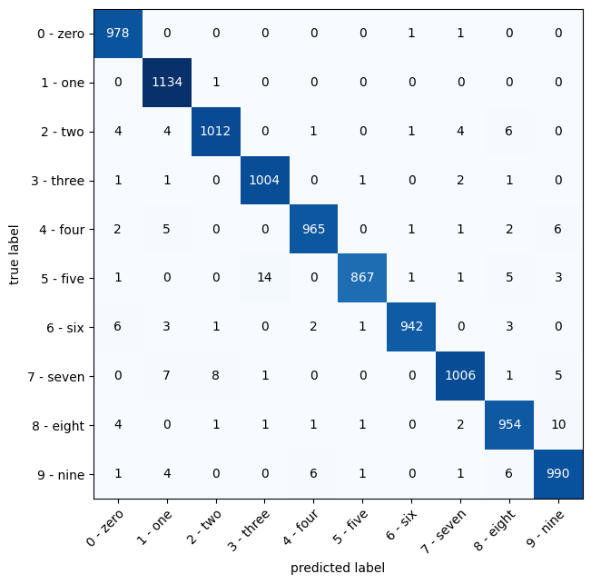

# PyTorch Notes

Some tips / things of notes for myself while I'm learning PyTorch

## What is PyTorch?

PyTorch is an open-source machine learning library widely used in academia and industry for building deep learning models. It offers dynamic computation graphs that provide flexibility and ease in debugging, making it especially suited for research and complex model development. PyTorch accelerates the training of models through efficient computaitons. It seamlessly integrates with GPU for enhanced computational speed, making it ideal for handling large-scale data in AI applications. It is particularly useful in fields like genomics, where understanding patterns in large volumes of data can lead to breakthroughs in understanding complex natural phenomena.


## Running PyTorch

The best place to get started running PyTorch code is with [Google Colab](https://colab.research.google.com/). It is a cloud-based Jupyter notebook environment provided by Google that allows users to write and execute Python code collaboratively in real-time. It comes pre-installed with PyTorch and a bunch of other useful libraries for data science and machine learning and it offers free access to GPUs and TPUs (this access is not guaranteed 24/7 but a lot of time you will be allocated a free device). 

## Tensors

Tensors are mathematical objects that generalize scalars, vectors, and matrices to higher dimensions. They are fundamental objects in linear algebra. 

Tensors are used extensively in various fields, including physics (especially in theories like general relativity and electromagnetism), engineering (for modeling stress and strain in materials), computer science (in machine learning, particularly in deep learning frameworks), and many other areas where multidimensional data needs to be manipulated and analyzed.

All data inputted and outputted out of models in PyTorch need to be represented as tensors.

### Tensor Size, Shape and Dimensions

In PyTorch, it's important to not conflate the concepts of tensor dimensions and tensor size and shape.

The number of dimensions that a tensor has can basically be determined by counting the number of square bracket pairs it has and can be found using `.ndim`

Tensor size and tensor shape are identical. They can be used to figure out the size of *each* dimension individually using `.shape` or `.size()`.

Example:

```python
TENSOR = torch.tensor([[[1, 2, 3],
                        [3, 6, 9],
                        [2, 4, 5]]])

TENSOR.ndim
# Outputs 3

TENSOR.shape
# Outputs torch.Size([1, 3, 3])

TENSOR.size()
# Outputs torch.Size([1, 3, 3])
```

Pictured Example:


### Converting between Numpy arrays and PyTorch tensors

Converting data between NumPy arrays and PyTorch tensors is a routine task. PyTorch tensors are similar to NumPy’s ndarrays, except that tensors can run on GPUs or other hardware accelerators. In fact, tensors and NumPy arrays can often share the same underlying memory, eliminating the need to copy data. There's 2 important difference that you have to remember when converting between the two objects.

1. PyTorch and Numpy have different default data types
    - NumPy arrays typically have a datatype of `float64` for floating-point numbers and `int64` for integers on most systems.
    - PyTorch tensors have a default datatype of `float32`
2. Numpy arrays cannot exist on a GPU, only a CPU, whereas PyTorch tensors can exist on both.

To convert NumPy arrays to PyTorch tensors, use the followings code and tools.

- Data in NumPy, want in PyTorch tensor -> `torch.from_numpy(ndarray)`
- PyTorch tensor, want in NumPy array -> `torch.Tensor.numpy()`
- For type coersion, `torch.from_numpy(ndarray).type(torch.float32)` 
- To convert PyTorch data on GPU to Numpy, use `torch.Tensor.cpu()`

**Note**: NumPy arrays cannot be generated from tensors that require gradient computation. Use `torch.Tensor.detach()` to remove tensors from computatation graphs.

## Device agnostic code

One of the most common errors in deep learning code is encountering a device error with some data or object in code. For example, you could try to multiply a tensor on a CPU with a tensor on a GPU and these two tensors will not be able to *find each other*, resulting in an error. 

Good machine learning code should never run into this error because the code should be **device agnostic**. To set up device agnostic code, write this code near the top of your script

```python
# Set up device agnostic code
device = "cuda" if torch.cuda.is_available() else "cpu"
print(f"Using device: {device}")
```

Then when you want to set the device attribute on piece of data or model, write 

```python
torch.Tensor.to(device)
```

This will ensure all data is on the same device, especially if a GPU is not available.

**Note:** If you are working with NumPy data, that data can only exist on a CPU. If a GPU is available and PyTorch data is sent to the GPU, you can still encounter device errors when working with these two types of data. Use `torch.Tensor.cpu()` on NumPy data to fix this.

### Figuring out if you're on a GPU

To check if you're running on a GPU in Google Collab, you can run

```python
torch.cuda.is_available()
```

which will return `true` or `false` based on whether or not you are on a GPU

If a GPU is available, you can check details for it using the following command in Google Colab

```bash
!nvidia-smi
```

which will output something like this if you are running on a GPU

```
Wed Mar 27 13:41:05 2024       
+---------------------------------------------------------------------------------------+
| NVIDIA-SMI 535.104.05             Driver Version: 535.104.05   CUDA Version: 12.2     |
|-----------------------------------------+----------------------+----------------------+
| GPU  Name                 Persistence-M | Bus-Id        Disp.A | Volatile Uncorr. ECC |
| Fan  Temp   Perf          Pwr:Usage/Cap |         Memory-Usage | GPU-Util  Compute M. |
|                                         |                      |               MIG M. |
|=========================================+======================+======================|
|   0  Tesla T4                       Off | 00000000:00:04.0 Off |                    0 |
| N/A   33C    P8               9W /  70W |      3MiB / 15360MiB |      0%      Default |
|                                         |                      |                  N/A |
+-----------------------------------------+----------------------+----------------------+
                                                                                         
+---------------------------------------------------------------------------------------+
| Processes:                                                                            |
|  GPU   GI   CI        PID   Type   Process name                            GPU Memory |
|        ID   ID                                                             Usage      |
|=======================================================================================|
|  No running processes found                                                           |
+---------------------------------------------------------------------------------------+
```

## Creating a machine learning model in PyTorch

Creating a model follows the following blueprint


The first line declares a class with whatever name you want for your model and that inherits from `nn.Module`. This is the base class for all neural network modules in PyTorch. 

The constructor function (`def __init__(self):`) is called every time you create an instance of the class. Inside the constructor, `super().__init__()` is called. This line calls the constructor of the superclass (`nn.Module`). 
In Python, `super()` is a built-in function that returns a proxy object that delegates method calls to a parent or superclass.

When you call `super().__init__()`, you are essentially calling the constructor (`__init__` method) of the superclass, which in this case is `nn.Module`. This line initializes the superclass, ensuring that any necessary setup defined in the superclass's constructor is executed before initializing the current class. 

By calling `super().__init__()`, you ensure that the subclass inherits all the attributes and methods of the superclass, which is essential for the proper functioning of the subclass and initialize the neural network module.

### the `forward` method

The `forward` method in a PyTorch `nn.Module` subclass defines the computation performed when the module is called with input data. This method outlines how input data flows through the network's layers to produce an output (defines the forward computation of the model). It ***must*** be overwritten for any class that inherits from `nn.Module` in order for the model to work (otherwise the model doesn't know how to pass the data through the layers).

#### Operator fusion

Operator fusion, in the context of deep learning frameworks like PyTorch, refers to the optimization technique where consecutive operations or layers are combined or fused into a single operation. By leveraging operator fusion, the deep learning framework can optimize the execution of operations, potentially reducing memory usage and improving performance, especially on hardware accelerators like GPUs and TPUs where memory access and data movement can be significant bottlenecks.

```python
class ModelName(nn.Module):
    
    ...

    def forward(self, x: torch.Tensor):
      # x = self.conv_block_1(x)
      # x = self.conv_block_2(x)
      # x = self.classifier(x)
      # return x
      return self.classifier(self.conv_block_2(self.conv_
      block_1(x))) # <- Operator fusion
```
### Creating Blocks within the model using `nn.Sequential()`

In PyTorch, `torch.nn.Sequential` is a container module that allows you to stack multiple layers or modules sequentially. It's commonly used to define a neural network model by specifying the layers or blocks one after another. You can define each block of your neural network as a sequence of layers or modules. These blocks can consist of linear layers, convolutional layers, activation functions, normalization layers, etc.

Using `torch.nn.Sequential`, you can then sequentially compose these blocks by passing them as arguments to the `Sequential` constructor. This ensures that the output of one block becomes the input to the next block.

By organizing your layers or modules into blocks and stacking them using `torch.nn.Sequential`, you create a structured architecture for your neural network model.

`torch.nn.Sequential` provides flexibility in designing complex architectures while keeping the code concise and readable. It allows you to easily experiment with different arrangements of blocks without needing to explicitly define each layer's input and output dimensions.

### Model outputs - Logits

Machine learning models can often times provide the raw outputs as **logits**. In machine learning, logits refer to the vector of raw (non-normalized) predictions that a classification model generates, which is ordinarily then passed to a normalization function. If the model is solving a multi-class classification problem, logits typically become an input to the softmax function. The softmax function then generates a vector of (normalized) probabilities with one value for each possible class.

Example (on MNIST data):

```python
# Logits -> Prediction probabilities -> Prediction labels
model_pred_logits = model(test_data[0][0].unsqueeze(dim=0).clone().detach().to(device)) 
model_pred_probs = torch.softmax(model_pred_logits, dim=1)
model_pred_label = torch.argmax(model_pred_probs, dim=1)
print(f"The logits are:\n{model_pred_logits}\n")
print(f"The prediction probabilities are:\n{model_pred_probs}\n")
print(f"The predicted label is:\n{model_pred_label}")
```

Outputs:

```
The logits are:
tensor([[ -9.2531,  -7.6084,  10.3126,  -1.2349,  -5.6690, -12.0427,  -9.8467,
          -4.8567,  -3.0213, -10.5510]], grad_fn=<AddmmBackward0>)

The prediction probabilities are:
tensor([[3.1821e-09, 1.6482e-08, 9.9999e-01, 9.6600e-06, 1.1463e-07, 1.9554e-10,
         1.7577e-09, 2.5826e-07, 1.6187e-06, 8.6907e-10]],
       grad_fn=<SoftmaxBackward0>)

The predicted label is:
tensor([2])
```

## Convolutional Neural Networks

Convolutional Neural Networks (CNNs) are a class of deep neural networks primarily used for analyzing visual imagery. They are designed to automatically and adaptively learn spatial hierarchies of features from input images. 

The key components of CNNs include:

1. **Convolutional Layers**: These layers apply convolution operations to the input image using learnable filters (also called kernels) to extract various features from the input image. Convolutional layers preserve the spatial relationship between pixels.

2. **Activation Functions**: Non-linear activation functions like ReLU (Rectified Linear Unit) are applied to the output of convolutional layers to introduce non-linearity and enable the network to learn complex patterns.

3. **Pooling** (or Subsampling) **Layers**: Pooling layers downsample the feature maps obtained from convolutional layers, reducing their spatial dimensions (width and height). Max pooling and average pooling are commonly used methods for this purpose.

4. **Fully Connected Layers** (or Dense Layers): These layers take the high-level features extracted by convolutional layers and learn to classify the input image into various classes. They perform classification based on the features extracted by previous layers.

5. **Flattening**: Before passing the output of convolutional layers to fully connected layers, the feature maps are typically flattened into a vector.


CNNs are widely used in computer vision tasks due to their ability to automatically learn hierarchical representations of features directly from raw pixel data, without the need for handcrafted feature extraction.

An example of a CNN built in PyTorch is as follows:

(This model is known as TinyVGG from the [CNN Explainer](https://poloclub.github.io/cnn-explainer/) website)

```python
class MNISTModelV2(nn.Module):


  def __init__(self, input_shape: int, hidden_units: int, output_shape: int):
    super().__init__()

    self.block_1 = nn.Sequential(
        nn.Conv2d(
            in_channels = input_shape,
            out_channels = hidden_units,
            kernel_size = 3, # How big is the square that is going over the image
            stride = 1, # default
            padding = 1 # options = "valid" (no padding), "same" (output has same shape as input), or int for specific number
        ),
        nn.ReLU()
    )
    self.block_2 = nn.Sequential(
        nn.Conv2d(
            in_channels = hidden_units,
            out_channels = hidden_units,
            kernel_size = 3,
            stride = 1,
            padding = 1
        ),
        nn.ReLU(),
        nn.MaxPool2d(
            kernel_size = 2,
            stride = 2 # default stride is the same as kernal size
        )
    )
    self.block_3 =  nn.Sequential(
        nn.Conv2d(
            in_channels = hidden_units,
            out_channels = hidden_units,
            kernel_size = 3, # How big is the square that is going over the image
            stride = 1, # default
            padding = 1 # options = "valid" (no padding), "same" (output has same shape as input), or int for specific number
        ),
        nn.ReLU()
    )
    self.block_4 = nn.Sequential(
        nn.Conv2d(
            in_channels = hidden_units,
            out_channels = hidden_units,
            kernel_size = 3,
            stride = 1,
            padding = 1
        ),
        nn.ReLU(),
        nn.MaxPool2d(
            kernel_size = 2,
            stride = 2 # default stride is the same as kernal size
        )
    )
    self.classifier = nn.Sequential(
        nn.Flatten(),
        nn.Linear(in_features = hidden_units,
                  out_features = output_shape)
    )

  def forward(self, x: torch.Tensor):
    # print(x.shape)
    x = self.block_1(x)
    # print(x.shape)
    x = self.block_2(x)
    # print(x.shape)
    x = self.block_3(x)
    # print(x.shape)
    x = self.block_4(x)
    # print(x.shape)
    x = self.classifier(x)
    # print(x.shape)
    return x

# Instantiate the model
model_2 = MNISTModelV2(input_shape = 1, 
                       hidden_units = 10, 
                       output_shape = len(train_data.classes))
```

### How to calculate the right amount of layers to add to your CNN

One of the most common issues in deep learning is shape errors, where the input data and output data dimensions are incompatible or tensor dimensions are incompatible for matrix/tensor multiplications. 

While it is possible to determine the input and output shapes mathematically in advance to building the model, an easier way is to just pass the data through the model one step at a time and print out the changes to their dimensions.

The steps to do this are.

1. Build a draft of your model with the inputs and output channels you think you need for each layer
2. Define your forward pass function.
3. Inside your forward pass function, add a `print` statement printing out the shape of each tensor before, during, and after it's passed through your model
4. Instantiate your model
5. Perform a forward pass with the data and check the outputs to see how the dimensions of the data are altered at every layer
6. If you encounter a shape incompatibility issue, modify the model and try again.

Example:

Here is the end portion of the code from the model above

```python
  # Define the forward pass 
  def forward(self, x: torch.Tensor):
    print(x.shape)
    x = self.block_1(x)
    print(x.shape)
    x = self.block_2(x)
    print(x.shape)
    x = self.block_3(x)
    print(x.shape)
    x = self.block_4(x)
    print(x.shape)
    x = self.classifier(x)
    print(x.shape)
    return x

# Instantiate the model
model_2 = MNISTModelV2(input_shape = 1, 
                       hidden_units = 10, 
                       output_shape = len(train_data.classes))

# Pass single image thorugh
single_image = train_features_batch[0].unsqueeze(0)

# Perform a forward pass
output = model_2(single_image)
```

This outputs:

```
torch.Size([1, 1, 28, 28])
torch.Size([1, 10, 28, 28])
torch.Size([1, 10, 14, 14])
torch.Size([1, 10, 14, 14])
torch.Size([1, 10, 7, 7])
---------------------------------------------------------------------------
RuntimeError                              Traceback (most recent call last)
<ipython-input-60-07dc6f7b23e2> in <cell line: 82>()
     80 single_image = train_features_batch[0].unsqueeze(0)
     81 
---> 82 output = model_2(single_image)
     83 
     84 

8 frames
/usr/local/lib/python3.10/dist-packages/torch/nn/modules/linear.py in forward(self, input)
    114 
    115     def forward(self, input: Tensor) -> Tensor:
--> 116         return F.linear(input, self.weight, self.bias)
    117 
    118     def extra_repr(self) -> str:

RuntimeError: mat1 and mat2 shapes cannot be multiplied (1x490 and 10x10)
```

This means that the model as it currently exists enounters a shape error when passing the data from the output of the fourth block to the input of the classifier block. 

Currently the classifier block looks like this

```python
    self.classifier = nn.Sequential(
        nn.Flatten(),
        nn.Linear(in_features = hidden_units, 
                  out_features = output_shape) 
    )
```

Where `10` was passed as the number of hidden units to be used as the input and the length of our data classes (in this case `10`) was passed as the number of units to be used as the output.

The error mentioned that there was a shape error trying to multiply `mat1` and `mat2` ($1\times490$ and $10\times10$, respectfully).

The $10\times10$ matrix hints to us that this matrix may be referring to the $\text{input features}\times \text{output features}$ of our classifier block.

To verify this, you can multiply the input features by a certain number to see if that changes the shape of one of the matrix dimensions.

```python
    self.classifier = nn.Sequential(
        nn.Flatten(),
        nn.Linear(in_features = hidden_units * 2, # Try multiplying input features by 2 
                  out_features = output_shape) 
    )
```

Now the error will be changed to 

```
... truncated output for space ...
RuntimeError: mat1 and mat2 shapes cannot be multiplied (1x490 and 20x10)
```

Since the $10\times10$ matrix changed to a $20\times10$ matrix when we multiplied the input units by 2, this dimension is referring to input features of the classifier block for sure.

So to fix our error, it is important to remember that the first matrix must have the same number of columns as the second matrix has rows. In other words, the **inner dimensions** must match.

To fix the matrix multiplication issue with the $1\times490$ and $10\times10$ matrices, we can multiply the input features of the classifier block by 49, or 7 * 7 (which corresponds to the height and width channels of the convoluted images outputted by the fourth block)

Example:

```python
    self.classifier = nn.Sequential(
        nn.Flatten(),
        nn.Linear(in_features = hidden_units * 7 * 7, # Multiply the input features to by the height and width channel sizes of the previous block's outputs
                  out_features = output_shape) 
    )
```

Now when we perform the forward pass with the same data, we get the following output.

```
torch.Size([1, 1, 28, 28])
torch.Size([1, 10, 28, 28])
torch.Size([1, 10, 14, 14])
torch.Size([1, 10, 14, 14])
torch.Size([1, 10, 7, 7])
torch.Size([1, 10])
```

Now our data flows through the model with no errors and outputs a tensor with a size of `[1, 10]`. That makes sense since we performed a forward pass on 1 image that could be classified as any one of 10 classes.

Once you've ensured there's no shape issues that can exist in your model you can go ahead and comment out or remove all the `print` statements in the forward function.


## Loss functions
- `nn.CrossEntropyLoss()` creates an instance of the CrossEntropyLoss class, which expects **logits** as inputs (raw scores from the network) and class labels. It internally applies `torch.log_softmax` to the logits before computing the negative log likelihood loss.
- BCEWithLogitsLoss() # Binary classification
    - Combines sigmoid activation function with BCELoss. Better than BCELoss because more numerically stable

## Running a train/test loop

### `optimizer.zero_grad()`

`optimizer.zero_grad()` is used to clear the gradients of all optimized tensors. Here's why it's necessary:

**Accumulation of Gradients**: During the backward pass, gradients are computed and accumulated in the `.grad` attribute of each parameter tensor. If you don't zero the gradients before the next backward pass, the new gradients will be added to the existing ones, leading to incorrect gradient values.

**Preventing Gradient Accumulation**: In many cases, you want to compute gradients for each batch of data separately. If you accumulate gradients across multiple batches, it effectively results in a larger batch size, which can lead to less stable training and divergence of the optimization process.

**Efficiency**: Zeroing the gradients also helps in memory efficiency. By clearing the gradients after each optimization step, you free up memory that would otherwise be occupied by the gradients of previous batches.

`optimizer.zero_grad()` ensures that you start each optimization step with fresh gradients, avoiding gradient accumulation issues and improving training stability and efficiency. It's an essential step in the training loop when using gradient-based optimization algorithms like stochastic gradient descent (SGD), Adam, etc.

### `optimizer.step()`

When you call the `.step()` function on an optimizer in PyTorch, it performs a single optimization step. Here's what happens during this step:

**Gradient Computation**: If you've previously performed a backward pass (by calling the `backward()` function on the loss tensor), gradients have been computed for all parameters that have `requires_grad=True`. These gradients are stored in the `.grad` attribute of each parameter tensor.

**Parameter Update**: The optimizer uses these computed gradients to update the parameters. The update rule depends on the optimization algorithm being used. For example, in stochastic gradient descent (SGD), the update rule for a parameter 


gradients to update the parameters. The update rule depends on the optimization algorithm being used. For example, in stochastic gradient descent (SGD), the update rule for a parameter $\theta$ is:

$$\theta_{\text {new }}=\theta_{\text {old }}- \text {learning-rate} \times \text{gradient}$$

The learning rate controls the step size of the update. Other optimization algorithms like Adam, Adagrad, etc., have more sophisticated update rules.

**Gradient Clearing**: After the parameter update, the gradients are cleared for the next iteration. This prevents gradients from accumulating across multiple `backward()` calls.

Calling `optimizer.step()` thus iterates through all the parameters registered with the optimizer, updates them according to their respective gradients and the optimization algorithm's update rule, and clears the gradients for the next iteration. This process is central to the training loop of a neural network, where parameters are iteratively updated to minimize the loss function and improve the model's performance.

## Saving a model 

For saving and loading models in PyTorch, there are three main methods you should be aware of (all of below have been taken from the [PyTorch saving and loading models guide](https://pytorch.org/tutorials/beginner/saving_loading_models.html#saving-loading-model-for-inference)):

|PyTorch method|What does it do?|
|:----|:----|
|[`torch.save`](https://pytorch.org/docs/stable/torch.html?highlight=save#torch.save)|Saves a serialized object to disk using Python's [`pickle`](https://docs.python.org/3/library/pickle.html) utility. Models, tensors and various other Python objects like dictionaries can be saved using `torch.save`.|
|[`torch.load`](https://pytorch.org/docs/stable/torch.html?highlight=torch%20load#torch.load)|Uses `pickle`'s unpickling features to deserialize and load pickled Python object files (like models, tensors or dictionaries) into memory. You can also set which device to load the object to (CPU, GPU etc).|
|[`torch.nn.Module.load_state_dict`](https://pytorch.org/docs/stable/generated/torch.nn.Module.html?highlight=load_state_dict#torch.nn.Module.load_state_dict)|Loads a model's parameter dictionary (`model.state_dict()`) using a saved `state_dict()` object.|

**Note**: As stated in [Python's `pickle` documentation](https://docs.python.org/3/library/pickle.html), the `pickle` module **is not secure**. That means you should only ever unpickle (load) data you trust. That goes for loading PyTorch models as well. Only ever use saved PyTorch models from sources you trust.

### PyTorch model's `state_dict()`

The recommended way for saving and loading a model for inference (making predictions) is by saving and loading a model's `state_dict()`.

This can be done a few steps:

1. Create a directory for saving models to called models using Python's `pathlib` module.

2. Create a file path to save the model to.

3. Call `torch.save(obj, f)` where `obj` is the target model's `state_dict()` and `f` is the filename of where to save the model.

**Note**: It's common convention for PyTorch saved models or objects to end with `.pt` or `.pth`.

Example: 

```python
from pathlib import Path

# 1. Create models directory 
MODEL_PATH = Path("models")
MODEL_PATH.mkdir(parents=True, exist_ok=True)

# 2. Create model save path 
MODEL_NAME = "01_pytorch_workflow_model_0.pth"
MODEL_SAVE_PATH = MODEL_PATH / MODEL_NAME

# 3. Save the model state dict 
print(f"Saving model to: {MODEL_SAVE_PATH}")
torch.save(obj=model_0.state_dict(), # only saving the state_dict() only saves the models learned parameters
           f=MODEL_SAVE_PATH) 
```

### Loading a model

Once you have a saved model's `state_dict()` saved on your machine, you can now load it in using `torch.nn.Module.load_state_dict(torch.load(f))` where `f` is the filepath of the saved model `state_dict()`.

Why call `torch.load()` inside `torch.nn.Module.load_state_dict()`?

Because we only saved the model's `state_dict()` which is a dictionary of learned parameters and not the entire model, we first have to load the `state_dict()` with `torch.load()` and then pass that `state_dict()` to a new instance of our model (which is a subclass of `nn.Module`).

Why not save the entire model?

Saving the entire model rather than just the `state_dict()` is more intuitive, however, accornding to the PyTorch documentation:

> The disadvantage of this approach (*saving the whole model*) is that the serialized data is bound to the specific classes and the exact directory structure used when the model is saved...

> Because of this, your code can break in various ways when used in other projects or after refactors.

So instead, saving and loading just the `state_dict()` (dictionary of model parameters) is a more flexible method.

Example:

```python
# Instantiate a new instance of our model (this will be instantiated with random weights)
loaded_model_0 = NameOfModelClass()

# Load the state_dict of our saved model (this will update the new instance of our model with trained weights)
loaded_model_0.load_state_dict(torch.load(f=MODEL_SAVE_PATH))
```

If you get the output `<All keys matched successfully>`, then it should have loaded correctly. It may still be a good idea to pass some data through your original model and your loaded model to see if you get the same output to be extra sure that your model was loaded correctly.

## PyTorch important tools and libraries

One of the benefits of Google Colab is that it comes pre-installed wiht a lot of useful PyTorch tools that help out with different parts of the workflow. 

Some of them are listed here


## Working with Images in PyTorch

Working with images is a common practice in deep learning. Even if the data you're working with aren't necessarily image data, sometimes converting that data into an image interpretation first can be a useful.

Below is a list of PyTorch computer vision libraries you should be aware of.

|PyTorch module|What does it do?|
|:----|:----|
|[`torchvision`](https://pytorch.org/vision/stable/index.html)|Contains datasets, model architectures and image transformations often used for computer vision problems.|
|[`torchvision.datasets`](https://pytorch.org/vision/stable/datasets.html)|Here you'll find many example computer vision datasets for a range of problems from image classification, object detection, image captioning, video classification and more. It also contains [a series of base classes for making custom datasets](https://pytorch.org/vision/stable/datasets.html#base-classes-for-custom-datasets).|
|[`torchvision.models`](https://pytorch.org/vision/stable/models.html)|This module contains well-performing and commonly used computer vision model architectures implemented in PyTorch, you can use these with your own problems.|
|[`torchvision.transforms`](https://pytorch.org/vision/stable/transforms.html)|Often images need to be transformed (turned into numbers/processed/augmented) before being used with a model, common image transformations are found here.|
|[`torch.utils.data.Dataset`](https://pytorch.org/docs/stable/data.html#torch.utils.data.Dataset)|Base dataset class for PyTorch.|
|[`torch.utils.data.DataLoader`](https://pytorch.org/docs/stable/data.html#module-torch.utils.data)|Creates a Python iterable over a dataset (created with `torch.utils.data.Dataset`).|

Preset datasets can be grabbed from `torchvision.datasets`. [See here for more information](https://www.learnpytorch.io/03_pytorch_computer_vision/#1-getting-a-dataset).

## Image dimensions in PyTorch

Images typically have 3 dimensions: Height (`H`), Width(`W`), and Colour Channels (`C`).

There's debate on whether images should be represented as `CHW` (color channels first) or `HWC` (color channels last).

**Note**: You'll also see `NCHW` and `NHWC` formats where `N` stands for number of images. For example if you have a `batch_size=32`, your tensor shape may be `[32, 1, 28, 28]`. 

PyTorch generally accepts `NCHW` (channels first) as the default for many operators.

However, PyTorch also explains that `NHWC` (channels last) performs better and is considered [best practice](https://pytorch.org/blog/tensor-memory-format-matters/#pytorch-best-practice).

The dimensions of a tensor can be easily rearranged with the `torch.permute()` function

Example:

```python
import torch

# Create a tensor of shape [32, 1, 28, 28]
tensor = torch.randn(32, 1, 28, 28)

# Use the permute function to reorder the dimensions
permuted_tensor = tensor.permute(0, 2, 3, 1)

# Print the shape of the permuted tensor
print(permuted_tensor.shape)
# Outputs: torch.Size([32, 28, 28, 1])
```

## Using Tensors with Matplotlib

Matplotlib is a Python library used for generating plots, charts, histograms, and other graphical representations of data. It's very useful for working with images in order to visualize the tensor representations of images to make sure the images are correct (using the `matplotlib.pyplot.imshow` method)

In order to pass a tensor into Matplotlib it's important to know two things.

- Matplotlib takes it's input as NumPy arrays (in `HWC` format)
- NumPy arrays cannot be generated from tensors that require gradient computation

To this end, the method `torch.Tensor.detach()` can help.

In PyTorch, `torch.Tensor.detach()` is a method used to detach a tensor from the computation graph. When you perform operations on tensors in PyTorch, the computational graph is built to keep track of the operations applied to tensors, which is essential for automatic differentiation during backpropagation.

However, sometimes you may want to work with tensors outside of the computational graph, such as when you want to stop gradients from being calculated with respect to a particular tensor. This is where `torch.Tensor.detach()` comes in handy.

When you call `torch.Tensor.detach()` on a tensor, it creates a new tensor that shares the same data but is detached from the computation graph. This means that gradients will not be calculated with respect to this tensor, and it will not be part of the computation graph for future operations.

This tensor can then be converted to a NumPy array using `torch.Tensor.numpy()`. You can also call `torch.Tensor.cpu()` beforehand to be safe because NumPy data can only exist on a CPU.

For example:

```python
import torch
import matplotlib.pyplot as plt

# Generate a random 64 x 64 image with 3 colour channels
EXAMPLE_IMAGE_TENSOR = torch.randn(64, 64, 3)

# Plot the image that the underlying tensor represents
plt.imshow(EXAMPLE_IMAGE_TENSOR.detach().cpu().numpy()) # Notice the detaching and conversion
```

**Note**: If the `torch.Tensor.detach()` method is ever not enough to solve this problem, try prefixing it with the `torch.Tensor.clone()` method (e.g. `EXAMPLE_IMAGE_TENSOR.clone().detach().cpu().numpy()`). This should most resolve any error you'd encounter.

## Inspecting datasets

Datasets from the `datasets` library come a a dataset object. Even if you convert them to tensors using 
the `ToTensor` transform, you still won't be able to operate on the tensor unless you know how to isolate the tensor. 


```python
# Import PyTorch
import torch
from torch import nn
from torch.utils.data import Dataset, DataLoader

# Import torchvision
import torchvision
from torchvision import datasets
from torchvision.transforms import ToTensor

# Import MNIST dataset
# Import training data
train_data = datasets.MNIST(
    root = "data", # where to download the data to?
    train = True, # Get the training data
    download = True, # Download the data if it doesn't exist on the dist
    transform = ToTensor(), # Transform the images into tensors. Default is PIL format
    target_transform = None # You can transform the labels as well
    )


print(train_data)
"""Outputs
Dataset MNIST
    Number of datapoints: 60000
    Root location: data
    Split: Train
    StandardTransform
Transform: ToTensor()
"""

print(str(train_data.__class__.mro()).replace(",", "\n"))
"""Outputs
[<class 'torchvision.datasets.mnist.MNIST'>
 <class 'torchvision.datasets.vision.VisionDataset'>
 <class 'torch.utils.data.dataset.Dataset'>
 <class 'typing.Generic'>
 <class 'object'>]
"""

print(train_data[0])
"""Outputs
(tensor([[[0.0000, 0.0000, 0.0000, 0.0000, 0.0000, 0.0000, 0.0000, 0.0000,
          ... truncated output to save space ...
          0.0000, 0.0000, 0.0000, 0.0000]]]), 5)
"""
# ^ The "5" at the end is the label. This is a tuple of a tensor and an integer

print(str(train_data[0].__class__.mro()).replace(",", "\n"))
"""Outputs
[ <class 'tuple'>
 <class 'object'>]
"""

print(train_data[0][0])
"""Outputs
tensor([[[0.0000, 0.0000, 0.0000, 0.0000, 0.0000, 0.0000, 0.0000, 0.0000,
          ... truncated output to save space ...
          0.0000, 0.0000, 0.0000, 0.0000]]])
"""

print(str(train_data[0][0].__class__.mro()).replace(",", "\n"))
"""Outputs
[<class 'torch.Tensor'>
 <class 'torch._C.TensorBase'>
 <class 'object'>]
"""

# ^ Now a tensor is isolated from the dataset and ready to be inspected
```

### DataLoaders

Once you a dataset ready to go, the next step is to prepare it with a `torch.utils.data.DataLoader` or `DataLoader` for short.

The `DataLoader` helps load data into a model for training and for inference. It turns a large Dataset into a Python iterable of smaller chunks. These smaller chunks are called **batches** or **mini-batches** and can be set by the `batch_size` parameter. It's good to do this because:

1. It's more computationally efficient. In an ideal world you could do the forward pass and backward pass across all of your data at once. But once you start using really large datasets, unless you've got infinite computing power, it's easier to break them up into batches.

2. It also gives your model more opportunities to improve. With mini-batches (small portions of the data), gradient descent is performed more often per epoch (once per mini-batch rather than once per epoch).

32 is often a good is a good place to start in terms of batch size for a fair amount of problems. But since this is a value you can set (a hyperparameter) you can try all different kinds of values, though generally powers of 2 are used most often (e.g. 32, 64, 128, 256, 512).

DataLoaders can be created as follows:

```python
from torch.utils.data import DataLoader

# Setup the batch size hyperparameter
BATCH_SIZE = 32

# Turn datasets into iterables (batches)
train_dataloader = DataLoader(train_data, # dataset to turn into iterable
    batch_size=BATCH_SIZE, # how many samples per batch? 
    shuffle=True # shuffle data every epoch?
)

test_dataloader = DataLoader(test_data,
    batch_size=BATCH_SIZE,
    shuffle=False # don't necessarily have to shuffle the testing data
)

# Let's check out what we've created
print(f"Dataloaders: {train_dataloader, test_dataloader}") 
print(f"Length of train dataloader: {len(train_dataloader)} batches of {BATCH_SIZE}")
print(f"Length of test dataloader: {len(test_dataloader)} batches of {BATCH_SIZE}")

"""Outputs
Dataloaders: (<torch.utils.data.dataloader.DataLoader object at 0x7fc991463cd0>, <torch.utils.data.dataloader.DataLoader object at 0x7fc991475120>)
Length of train dataloader: 1875 batches of 32
Length of test dataloader: 313 batches of 32
"""
```

There are also a few other parameters you might want to add to your DataLoaders:

- `num_workers`: This parameter specifies the number of worker processes to use for data loading. Increasing the number of workers can speed up data loading by loading batches in parallel. You can set it to the number of CPU cores by using the `os` library as such `num_workers = os.cpu_count()`.

- `pin_memory`: This parameter specifies whether to use pinned memory for faster data transfer to the GPU. When `pin_memory` is set to `True`, data is moved to CUDA pinned memory before transferring it to the GPU, which can improve the speed of data transfer.

### Getting the data out of DataLoaders

You can use  `next(iter(DATALOADER_OBJECT))`, to get your data out of dataloaders

Example:

```python
train_features_batch, train_labels_batch = next(iter(train_dataloader))
```

1. `train_dataloader` is an iterable object (likely a `DataLoader` instance) containing batches of training data.
2. `iter(train_dataloader)` creates an iterator from `train_dataloader`, allowing us to iterate over its batches.
3. `next(...)` retrieves the next batch from the iterator.
4. `train_features_batch, train_labels_batch` unpacks the features (input data) and labels from the retrieved batch.

Overall, this line of code fetches the next batch of training data and separates it into features and labels, assigning them to the variables `train_features_batch` and `train_labels_batch`, respectively. This is often used in training loops to iterate over batches of data for model training.

## Using Custom Data for PyTorch projects

Often times, the data you'll want to run an experiment on won't come ready made in a PyTorch library. To use your own custom data, you need to do a bit of pre-processing on it to make sure it is compatible with pytorch.

To make them compatible with PyTorch, you need to 

1. Download the data and organize it. 
    
    - It's of a good idea to organize your data in a directory structure that is already self explanatory with training and testing data seperated and correct labels being used as directory names
        - Example:
```
pizza_steak_sushi/ <- overall dataset folder
    train/ <- training images
        pizza/ <- class name as folder name
            image01.jpeg
            image02.jpeg
            ...
        steak/
            image24.jpeg
            image25.jpeg
            ...
        sushi/
            image37.jpeg
            ...
    test/ <- testing images
        pizza/
            image101.jpeg
            image102.jpeg
            ...
        steak/
            image154.jpeg
            image155.jpeg
            ...
        sushi/
            image167.jpeg
            ...
```

2. If needed, augmenting the data with `torchvision.transforms` (if working with image data)

3. Transforming the data into tensors

3. Turning the tensor data into a `torch.utils.data.Dataset` (or loading it with `torchvision.datasets.ImageFolder` if it is an image) and later a `torch.utils.data.DataLoader`

An example of how this is done is as follows:

```python
# Download 20% data for Pizza/Steak/Sushi from GitHub
import requests
import zipfile
from pathlib import Path
from torchvision.datasets import ImageFolder
from torchvision import transforms
from torch.utils.data import DataLoader

# Setup path to data folder
data_path = Path("data/")
image_path = data_path / "pizza_steak_sushi_20_percent"

# If the image folder doesn't exist, download it and prepare it...
if image_path.is_dir():
  print(f"{image_path} directory exists.")
else:
  print(f"Did not find {image_path} directory, creating one...")
  image_path.mkdir(parents = True, exist_ok = True)

# Download pizza, steak, sushi data
with open(data_path / "pizza_steak_sushi_20_percent.zip", "wb") as f:
  request = requests.get("https://github.com/mrdbourke/pytorch-deep-learning/raw/main/data/pizza_steak_sushi_20_percent.zip")
  print("Downloading pizza, steak, sushi 20% data...")
  f.write(request.content)

# Unzip pizza, steak, and sushi data
with zipfile.ZipFile(data_path / "pizza_steak_sushi_20_percent.zip", "r") as zip_ref:
  print("Unzipping pizza, steak, sushi 20% data...")
  zip_ref.extractall(image_path)

# Transform the data for to standardized tensors
simple_transform = transforms.Compose([
    transforms.Resize((64, 64)),
    transforms.ToTensor()
])

# Create Datasets
train_data_20_percent = ImageFolder(train_data_20_percent_path,
                                    transform = simple_transform)

test_data_20_percent = ImageFolder(test_data_20_percent_path, 
                                   transform = simple_transform)

# Create DataLoaders
train_dataloader_20_percent = DataLoader(train_data_20_percent,
                                         batch_size = 32,
                                         num_workers = os.cpu_count(),
                                         shuffle = True)

test_dataloader_20_percent = DataLoader(test_data_20_percent,
                                        batch_size = 32,
                                        num_workers = os.cpu_count(),
                                        shuffle = False)
```

For more information on the data loading process, [see here](https://www.learnpytorch.io/04_pytorch_custom_datasets/).

## Organizing PyTorch projects

Once you have a machine learning project that you want to save, it may be a good idea to organize it into modules. 


You may want the model to be launched from a command line executable. 


Notebooks are fantastic for iteratively exploring and running experiments quickly.

However, for larger scale projects you may find Python scripts more reproducible and easier to run.

There's arguments for both sides.

| |**Pros**|**Cons**|
|:----|:----|:----|
|**Notebooks**|Easy to experiment/get started|Versioning can be hard|
| |Easy to share (e.g. a link to a Google Colab notebook)|Hard to use only specific parts|
| |Very visual|Text and graphics can get in the way of code|
| | 
|**Python scripts**|Can package code together (saves rewriting similar code across different notebooks)|Experimenting isn't as visual (usually have to run the whole script rather than one cell)|
| |Can use git for versioning| |
| |Many open source projects use scripts| |
| |Larger projects can be run on cloud vendors (not as much support for notebooks)| |

In anycase, a good workflow is to start on Google Colab and move important code to scripts if you would like


### Jupyter cell magic commands

Jupyter cell magic commands are special commands that can be used in Jupyter notebooks to perform various tasks or change the behavior of code cells. These commands are preceded by one or two percent signs (`%` or `%%`) and are often used to streamline common tasks, interact with the notebook environment, or access system-level functionalities.

A very useful magic command to help convert the code in the code cell into a script is the `%%writefile` command. It's used as follows:

```
%%writefile DIR_NAME/SCRIPT_NAME.py

# Your Python code goes here
```

Executing this code cell will write all the code in the code cell into a script in the provided path.

Examples of python scripts can be found in this GitHub Repository inside the `modules` folder. The `train.py` file contains the information needed to train a model and can be run using 

```bash
python train.py --num_epochs 5 --batch_size 128 --hidden_units 128 --hidden_units 128 --learning_rate 0.0003
```

Take a look at the `modules` directory to see how all these python scripts interact to build and train a functioning model.

## `model.parameters` vs `model.state_dict`

In PyTorch, both model.parameters() and model.state_dict() are methods of viewing the parameters of a neural network model, but they are used in seperate circumstances:

`model.parameters()` returns an iterator over all the learnable parameters of the model. These parameters include weights and biases of layers such as linear layers, convolutional layers, etc.

When you're training a model, you typically use `model.parameters()` to obtain the parameters that need to be updated by the optimizer during the training process.

However, if you wanted to view the parameters of your model yourself, the output of `model.parameters()` might be too overwhelming to understand so it's better to use `model.state_dict()` instead.

`model.state_dict()` returns a dictionary containing the entire state of the model, including parameters and other persistent buffers. The keys of the dictionary are the names of the parameters, and the values are the parameter tensors.

This method is often used for checkpointing the model or for saving and loading model weights and configurations, but can also be used to preview the parameters of a model (however if the model get's too big then the output of this method will also become uninterpretable and other methods of checking the models parameters will need to be employed).


## `model.train()`, `model.eval()`, and `torch.inference_mode()` 

## Random Seeds 

Random seeds can be set before generating random data to ensure reproducibility, however setting manual seeds for random number generators in deep learning frameworks like PyTorch or TensorFlow is not generally recommended, because you want to make sure that the parameters your model learns are similar regardless of what random weights and biases they started with. However, if you do want to set random seeds, there are a few things you should know

You can set a random seed using 
```python
RANDOM_SEED = 42
torch.manual_seed(RANDOM_SEED)
```

However be aware that random seeds aren't applied to every random generation in the code.

Example:

```python
# Let's make some random but reproducible tensors
import torch

# Set the random seed
RANDOM_SEED = 42
torch.manual_seed(RANDOM_SEED) # SEED SET

# Generate random tensors
random_tensor_A = torch.rand(3,4)
random_tensor_B = torch.rand(3, 4)

# Print random tensors
print(random_tensor_A)
print(random_tensor_B)

# Check if random tensors are equal
print(random_tensor_A == random_tensor_B)
```

Outputs

```
tensor([[0.8823, 0.9150, 0.3829, 0.9593],
        [0.3904, 0.6009, 0.2566, 0.7936],
        [0.9408, 0.1332, 0.9346, 0.5936]])
tensor([[0.8694, 0.5677, 0.7411, 0.4294],
        [0.8854, 0.5739, 0.2666, 0.6274],
        [0.2696, 0.4414, 0.2969, 0.8317]])
tensor([[False, False, False, False],
        [False, False, False, False],
        [False, False, False, False]])
```

To fix this issue, keep setting the same random seed before every random generation.

Example

```python
# Let's make some random but reproducible tensors
import torch

# Set the random seed
RANDOM_SEED = 42

# Generate random tensors
torch.manual_seed(RANDOM_SEED) # FIRST SEED SET
random_tensor_A = torch.rand(3,4)

torch.manual_seed(RANDOM_SEED) # SECOND SEED SET
random_tensor_B = torch.rand(3, 4)

# Print random tensors
print(random_tensor_A)
print(random_tensor_B)

# Check if random tensors are equal
print(random_tensor_A == random_tensor_B)
```

Outputs

```
tensor([[0.8823, 0.9150, 0.3829, 0.9593],
        [0.3904, 0.6009, 0.2566, 0.7936],
        [0.9408, 0.1332, 0.9346, 0.5936]])
tensor([[0.8823, 0.9150, 0.3829, 0.9593],
        [0.3904, 0.6009, 0.2566, 0.7936],
        [0.9408, 0.1332, 0.9346, 0.5936]])
tensor([[True, True, True, True],
        [True, True, True, True],
        [True, True, True, True]])
```

Additionally, if you want to set the manual seed on a GPU, use

```python
torch.cuda.manual_seed(seed)
```

## Multiples of 8

Multiples of 8 are often recommended for machine learning, particularly in neural network architectures, due to their compatibility with hardware optimizations, specifically related to parallel processing and memory alignment. You should strive to use as many multiples of 8 (i.e. 8, 16, 32, 64, 128, 256, etc.) for hyperparameters such as number of units in hidden layers, batch sizes, etc.

### Minibatches, multiples of 8, and not going higher than 32

Mini-batches are subsets of a dataset used during the training process of machine learning models, particularly in deep learning. Instead of feeding the entire dataset into the model at once, mini-batch training involves dividing the dataset into smaller batches and processing each batch sequentially during training. 

In that same vain as above, minibatches should also be set to multiples of 8, but also it is often recommended to use minibatches of [around 32](https://arxiv.org/abs/1804.07612), especially when first starting building your model, as this strikes a balance between utilizing GPU memory efficiently and allowing for a reasonable training speed.

## SciKitLearn train/test split


In scikit-learn, the `train_test_split` function is a utility that splits a dataset into random train and test subsets. 

```python
from sklearn.model_selection import train_test_split
RANDOM_SEED = 42

# Create a split in the data. 80% to the training set and 20% to the testing set
X_train, X_test, y_train, y_test = train_test_split(data, labels, train_size=0.8, random_state=RANDOM_SEED)
```

### Creating a Development / Cross-validation set

Development sets are further subsets of the data. They are useful because this subset of the dataset can be used to evaluate a model's performance during training. It helps in tuning hyperparameters and assessing how well the model generalizes to new, unseen data. By having a separate validation set, the model's performance can be assessed without biasing hyperparameter tuning decisions based on the test set's results. This helps prevent overfitting and ensures that the model generalizes well to unseen data.

If you want to create a dev / cross-validation set, you can further split the data by calling the `train_test_split` function again. However, you will have to calculate what percent of the subsetted data you will need to split in order to get the percent of the total data into your dev set.

For example, if you have 100 samples total, and you want to get 10 samples (10% of the total) into your dev set, assuming you did a 80/20 split first on the training and test set:
- If you create a dev set by splitting up the testing set (most commmon practice), you will need to split 50% of the data to get the desired 10% split of the total data
- If you create a dev set by splitting up the training set, you will need to split 12.5% of the data to get the desired 10% split of the total data

Example:

```python
p_train_data = 0.8
desired_p_dev_set_split = 0.1
data_to_split = "test"

# Create dev set by splitting up the test set (most common)
if data_to_split == "split_train" and desired_p_dev_set_split <= (1 - p_train_data): # Only split test set if mathematically possible
    actual_p_dev_set_split = round((1 / (1 - p_train_data)) * (desired_p_dev_set_split), 4)
    X_dev, X_test, y_dev, y_test = train_test_split(X_test, y_test, train_size=actual_p_dev_set_split, random_state=RANDOM_SEED)

# Create dev set by splitting up the train set
if data_to_split == "split_train" and desired_p_dev_set_split <= p_train_data: # Only split train set if mathematically possible
    actual_p_dev_set_split = round((1 / (p_train_data)) * (desired_p_dev_set_split), 4)
    X_dev, X_train, y_dev, y_train = train_test_split(X_train, y_train, train_size=actual_p_dev_set_split, random_state=RANDOM_SEED)
```

## TorchMetrics

TorchMetrics is a library in PyTorch specifically designed for efficient metrics computation in machine learning and deep learning tasks. It provides a wide range of metrics commonly used for evaluating model performance during training and validation. Some of these include:

|**Metric name/Evaluation method**|**Defintion**|**Code**|
|:----|:----|:----|
|Accuracy|Out of 100 predictions, how many does your model get correct? E.g. 95% accuracy means it gets 95/100 predictions correct.|[`torchmetrics.Accuracy()`](https://torchmetrics.readthedocs.io/en/stable/classification/accuracy.html#id3) or [`sklearn.metrics.accuracy_score()`](https://scikit-learn.org/stable/modules/generated/sklearn.metrics.accuracy_score.html)|
|Precision|Proportion of true positives over total number of samples. Higher precision leads to less false positives (model predicts 1 when it should've been 0).|[`torchmetrics.Precision()`](https://torchmetrics.readthedocs.io/en/stable/classification/precision.html#id4) or [`sklearn.metrics.precision_score()`](https://scikit-learn.org/stable/modules/generated/sklearn.metrics.precision_score.html)|
|Recall|Proportion of true positives over total number of true positives and false negatives (model predicts 0 when it should've been 1). Higher recall leads to less false negatives.|[`torchmetrics.Recall()`](https://torchmetrics.readthedocs.io/en/stable/classification/recall.html#id5) or [`sklearn.metrics.recall_score()`](https://scikit-learn.org/stable/modules/generated/sklearn.metrics.recall_score.html)|
|F1-score|Combines precision and recall into one metric. 1 is best, 0 is worst.|[`torchmetrics.F1Score()`](https://torchmetrics.readthedocs.io/en/stable/classification/f1_score.html#f1score) or [`sklearn.metrics.f1_score()`](https://scikit-learn.org/stable/modules/generated/sklearn.metrics.f1_score.html)|
|[Confusion matrix](https://www.dataschool.io/simple-guide-to-confusion-matrix-terminology/)|Compares the predicted values with the true values in a tabular way, if 100% correct, all values in the matrix will be top left to bottom right (diagnol line).|[`torchmetrics.ConfusionMatrix`](https://torchmetrics.readthedocs.io/en/stable/classification/confusion_matrix.html#confusionmatrix) or [`sklearn.metrics.plot_confusion_matrix()`](https://scikit-learn.org/stable/modules/generated/sklearn.metrics.ConfusionMatrixDisplay.html#sklearn.metrics.ConfusionMatrixDisplay.from_predictions)|
|Classification report|Collection of some of the main classification metrics such as precision, recall and f1-score.|[`sklearn.metrics.classification_report()`](https://scikit-learn.org/stable/modules/generated/sklearn.metrics.classification_report.html)|

### Installing and Using TorchMetrics

TorchMetrics *does not come pre-intstalled on Google Colab*, therefore you have to manually install it. Additionally, it is important to remember *send your accuracy model to your target device* in order for it to be able to interact with your data.

The following template code shows how to install and use TorchMetrics:

```python
try:
    from torchmetrics import Accuracy
except:
    !pip install torchmetrics
    from torchmetrics import Accuracy

# Setup metric and make sure it's on the target device
torchmetrics_accuracy = Accuracy(task='multiclass', num_classes=4).to(device)

# Calculate accuracy
torchmetrics_accuracy(y_preds, y_test)
```

The `torchmetrics.Accuracy` function is a simple wrapper to get the task specific versions of this metric, which is done by setting the task argument to either `binary`, `multiclass` or `multilabel`(which calls `torchmetrics.classification.BinaryAccuracy`, `torchmetrics.classification.MulticlassAccuracy`, or `torchmetrics.classification.MultilabelAccuracy`, respectively).

Here in this example `torchmetrics.Accuracy` returned `torchmetrics.classification.MulticlassAccuracy`. This function takes two inputs:
- `preds (Tensor)`: An `int` tensor of shape `(N, ...)` or `float` tensor of shape `(N, C, ...)`. 
    - If preds is a floating point the function applies `torch.argmax` along the `C` dimension to automatically convert probabilities/logits into an `int` tensor.

- `target` (Tensor): An `int` tensor of shape `(N, ...)`

### Precision vs Recall

Precision and recall are two important metrics used to evaluate the performance of classification models, especially in situations where there is class imbalance. They are often used together to provide a more comprehensive understanding of a model's performance.


- **Precision**:
  - Precision measures the accuracy of positive predictions made by the model.
  - It is calculated as the ratio of true positive predictions to the total number of positive predictions made by the model, regardless of whether they are correct or incorrect.
  - Precision focuses on minimizing false positives, meaning it measures how many of the predicted positive instances are actually true positives.

- **Recall**:
  - Recall measures the ability of the model to capture all the positive instances in the dataset.
  - It is calculated as the ratio of true positive predictions to the total number of actual positive instances in the dataset.
  - Recall focuses on minimizing false negatives, meaning it measures how many of the true positive instances are captured by the model.
- Trade-off:
  - Precision and recall often have an inverse relationship. Improving precision typically reduces recall and vice versa.
  - The choice between precision and recall depends on the specific requirements of the problem. For example, in applications where false positives are costly (e.g., medical diagnosis), precision may be prioritized. In contrast, in applications where false negatives are more critical (e.g., detecting fraud), recall may be prioritized.
  - **F1 Score**, the harmonic mean of precision and recall, is commonly used to balance the trade-off between the two metrics.

Precision and recall provide complementary insights into the performance of a classification model, helping to assess its ability to make correct positive predictions and capture all positive instances in the dataset.

## Torchinfo

Torchinfo is a Python package that provides a convenient way to print concise summaries of PyTorch models, displaying information such as the input/output shapes of each layer, the number of parameters in each layer, and the total number of parameters in the model. These summaries are helpful for debugging models, understanding their architecture, and ensuring that they are constructed correctly. It can be particularly useful when working with complex neural network architectures or when debugging issues related to input/output shapes.

Torchinfo does not come pre-installed with Google Colab, and so needs to be installed manually as so:

```python
try:
  from torchinfo import summary
except:
  print(f"[INFO] Couldn't find torchinfo... installing it.")
  !pip install -q torchinfo
  from torchinfo import summary
```

Torch info can be used as follows:

```python
from torchinfo import summary

model = ConvNet()
batch_size = 16
summary(model, input_size=(batch_size, 1, 28, 28))
```

And will produce an output similar to this:

```
================================================================================================================
Layer (type:depth-idx)          Input Shape          Output Shape         Param #            Mult-Adds
================================================================================================================
SingleInputNet                  [7, 1, 28, 28]       [7, 10]              --                 --
├─Conv2d: 1-1                   [7, 1, 28, 28]       [7, 10, 24, 24]      260                1,048,320
├─Conv2d: 1-2                   [7, 10, 12, 12]      [7, 20, 8, 8]        5,020              2,248,960
├─Dropout2d: 1-3                [7, 20, 8, 8]        [7, 20, 8, 8]        --                 --
├─Linear: 1-4                   [7, 320]             [7, 50]              16,050             112,350
├─Linear: 1-5                   [7, 50]              [7, 10]              510                3,570
================================================================================================================
Total params: 21,840
Trainable params: 21,840
Non-trainable params: 0
Total mult-adds (M): 3.41
================================================================================================================
Input size (MB): 0.02
Forward/backward pass size (MB): 0.40
Params size (MB): 0.09
Estimated Total Size (MB): 0.51
================================================================================================================
```

For more information on how to use it, see [here](https://www.learnpytorch.io/06_pytorch_transfer_learning/#33-getting-a-summary-of-our-model-with-torchinfosummary) or the [torchinfo GitHub](https://github.com/TylerYep/torchinfo).

## Timing your models with `timeit`

Timing your models can be done easily using the `timeit` library

```python
from timeit import default_timer as timer
```

Use the timer as such

```python
# Start the timer
from timeit import default_timer as timer 
start_time = timer()

# Train your model
...

# End the timer and print out how long it took
end_time = timer()
print(f"[INFO] Total training time: {end_time-start_time:.3f} seconds")
```

For more information see [here](https://www.learnpytorch.io/03_pytorch_computer_vision/#32-creating-a-function-to-time-our-experiments).

## Adding a progress bar to your models with `tqdm`

The `tqdm` library provides a progress bar for your code. It can wrap around loops and tell you the progress of your loop.

1. When running in a Jupyter notebook or an IPython terminal, it will use the `tqdm.notebook` submodule, which provides a more interactive progress bar.

2. In a regular Python environment, it will use the `tqdm.std` submodule, which provides a simpler text-based progress bar suitable for console applications.

`from tqdm.auto` automatically detects the execution environment and chooses the appropriate submodule, simplifying the usage of tqdm without the need for manual selection. It allows for a seamless experience when working in different environments.

```python
from tqdm.auto import tqdm
for i in tqdm(range(10000)):
    ...
```

## Transfer learning 

Transfer learning is a machine learning technique where a model trained on one task is adapted or transferred to a related but different task. Instead of training a model from scratch, transfer learning leverages knowledge gained from solving one problem to help solve a different but related problem. This approach is particularly useful when working with limited data or computational resources and can significantly reduce training time and improve performance.

Often times machine learning architects will start a new data science project by using another trained model as a backbone and modifying it for their purpose 

### Resources for finding pre-trained models 

|**Location**|**What's there?**|**Link(s)**|
|:----|:----|:----|
|**PyTorch domain libraries**|Each of the PyTorch domain libraries (`torchvision`, `torchtext`) come with pretrained models of some form. The models there work right within PyTorch.|[`torchvision.models`](https://pytorch.org/vision/stable/models.html), [`torchtext.models`](https://pytorch.org/text/main/models.html), [`torchaudio.models`](https://pytorch.org/audio/stable/models.html), [`torchrec.models`](https://pytorch.org/torchrec/torchrec.models.html)|
|**HuggingFace Hub**|A series of pretrained models on many different domains (vision, text, audio and more) from organizations around the world. There's plenty of different datasets too.|https://huggingface.co/models, https://huggingface.co/datasets|
|**`timm` (PyTorch Image Models) library**|Almost all of the latest and greatest computer vision models in PyTorch code as well as plenty of other helpful computer vision features.|https://github.com/rwightman/pytorch-image-models|
|**Paperswithcode**|A collection of the latest state-of-the-art machine learning papers with code implementations attached. You can also find benchmarks here of model performance on different tasks.|https://paperswithcode.com/|

**Note**: Often times with transfer learning you'll want to pick a pre-trained model that offers the best performance without having too many parameters. This is a trade off you'll have to make to ensure your models don't take too long to run. Take a look at the accuracy and parameter values closely for each model.

### Transforming data for transfer learning

When using a pretrained model, it's important that **your custom data going into the model is prepared in the same way as the original training data that went into the model**.

You can manually create these transforms on your data using `transforms.Normalize()` as shown [here](https://www.learnpytorch.io/06_pytorch_transfer_learning/#21-creating-a-transform-for-torchvisionmodels-manual-creation). 

However, as of `torchvision v0.13+`, an automatic transform creation feature has been added.

When you setup a model from `torchvision.models` and select the pretrained model weights you'd like to use, for example, say we'd like to use:

```python
weights = torchvision.models.EfficientNet_B0_Weights.DEFAULT

weights
# Outputs: EfficientNet_B0_Weights.IMAGENET1K_V1
```


Where,
- `EfficientNet_B0_Weights` is the model architecture weights we'd like to use (there are many differnt model architecture options in `torchvision.models`).
- `DEFAULT` means the *best available* weights (the best performance in ImageNet).

**Note**: Depending on the model architecture you choose, you may also see other options such as `IMAGENET_V1` and `IMAGENET_V2` where generally the higher version number the better. Though if you want the best available, `DEFAULT` is the easiest option. See the [`torchvision.models` documentation](https://pytorch.org/vision/main/models.html) for more.

Now to access the transforms assosciated with the weights, you can use the `transforms()` method. This is essentially saying "get the data transforms that were used to train the `EfficientNet_B0_Weights` on ImageNet".

Example: 

```python
# Get the transforms used to create our pretrained weights
auto_transforms = weights.transforms()
auto_transforms
```

Outputs:

```
ImageClassification(
    crop_size=[224]
    resize_size=[256]
    mean=[0.485, 0.456, 0.406]
    std=[0.229, 0.224, 0.225]
    interpolation=InterpolationMode.BICUBIC
)
```

The benefit of automatically creating a transform through `weights.transforms()` is that you ensure you're using the same data transformation as the pretrained model used when it was trained.

However, the tradeoff of using automatically created transforms is a lack of customization.

You can use the automatic transforms that you created as the an input to any argument that takes in a `transforms.Compose` as input, as is the case with the `create_dataloaders()` function for creating `DataLoaders` in `modules/data_setup.py`.

Example:

```python
# Create training and testing DataLoaders as well as get a list of class names
train_dataloader, test_dataloader, class_names = data_setup.create_dataloaders(train_dir=train_dir,
                                                                               test_dir=test_dir,
                                                                               transform=auto_transforms, # perform same data transforms on our own data as the pretrained model
                                                                               batch_size=32) # set mini-batch size to 32

train_dataloader, test_dataloader, class_names
```

### Downloading a pre-trained model

Once you have a pre-trained model you would like to use as a scaffold, the next step is to download it into your environment so that you can begin tweaking it.

This can be done as shown:
- **Note**: as of `torchvision v0.13+`, downloading a model also involves the use of the `.DEFAULT` attrubute

```python
# OLD: Setup the model with pretrained weights and send it to the target device (this was prior to torchvision v0.13)
# model = torchvision.models.efficientnet_b0(pretrained=True).to(device) # OLD method (with pretrained=True)

# NEW: Setup the model with pretrained weights and send it to the target device (torchvision v0.13+)
weights = torchvision.models.EfficientNet_B0_Weights.DEFAULT # .DEFAULT = best available weights 
model = torchvision.models.efficientnet_b0(weights=weights).to(device)
```

Now you can observe your model with torchinfo

```python
# Print a summary using torchinfo 
summary(model=model, 
        input_size=(32, 3, 224, 224),
        col_names=["input_size", "output_size", "num_params", "trainable"],
        col_width=20,
        row_settings=["var_names"]
) 
```

Outputs:

```
============================================================================================================================================
Layer (type (var_name))                                      Input Shape          Output Shape         Param #              Trainable
============================================================================================================================================
EfficientNet (EfficientNet)                                  [32, 3, 224, 224]    [32, 1000]           --                   True
├─Sequential (features)                                      [32, 3, 224, 224]    [32, 1280, 7, 7]     --                   True
│    └─Conv2dNormActivation (0)                              [32, 3, 224, 224]    [32, 32, 112, 112]   --                   True
│    │    └─Conv2d (0)                                       [32, 3, 224, 224]    [32, 32, 112, 112]   864                  True
│    │    └─BatchNorm2d (1)                                  [32, 32, 112, 112]   [32, 32, 112, 112]   64                   True
│    │    └─SiLU (2)                                         [32, 32, 112, 112]   [32, 32, 112, 112]   --                   --
│    └─Sequential (1)                                        [32, 32, 112, 112]   [32, 16, 112, 112]   --                   True
│    │    └─MBConv (0)                                       [32, 32, 112, 112]   [32, 16, 112, 112]   1,448                True
│    └─Sequential (2)                                        [32, 16, 112, 112]   [32, 24, 56, 56]     --                   True
│    │    └─MBConv (0)                                       [32, 16, 112, 112]   [32, 24, 56, 56]     6,004                True
│    │    └─MBConv (1)                                       [32, 24, 56, 56]     [32, 24, 56, 56]     10,710               True
│    └─Sequential (3)                                        [32, 24, 56, 56]     [32, 40, 28, 28]     --                   True
│    │    └─MBConv (0)                                       [32, 24, 56, 56]     [32, 40, 28, 28]     15,350               True
│    │    └─MBConv (1)                                       [32, 40, 28, 28]     [32, 40, 28, 28]     31,290               True
│    └─Sequential (4)                                        [32, 40, 28, 28]     [32, 80, 14, 14]     --                   True
│    │    └─MBConv (0)                                       [32, 40, 28, 28]     [32, 80, 14, 14]     37,130               True
│    │    └─MBConv (1)                                       [32, 80, 14, 14]     [32, 80, 14, 14]     102,900              True
│    │    └─MBConv (2)                                       [32, 80, 14, 14]     [32, 80, 14, 14]     102,900              True
│    └─Sequential (5)                                        [32, 80, 14, 14]     [32, 112, 14, 14]    --                   True
│    │    └─MBConv (0)                                       [32, 80, 14, 14]     [32, 112, 14, 14]    126,004              True
│    │    └─MBConv (1)                                       [32, 112, 14, 14]    [32, 112, 14, 14]    208,572              True
│    │    └─MBConv (2)                                       [32, 112, 14, 14]    [32, 112, 14, 14]    208,572              True
│    └─Sequential (6)                                        [32, 112, 14, 14]    [32, 192, 7, 7]      --                   True
│    │    └─MBConv (0)                                       [32, 112, 14, 14]    [32, 192, 7, 7]      262,492              True
│    │    └─MBConv (1)                                       [32, 192, 7, 7]      [32, 192, 7, 7]      587,952              True
│    │    └─MBConv (2)                                       [32, 192, 7, 7]      [32, 192, 7, 7]      587,952              True
│    │    └─MBConv (3)                                       [32, 192, 7, 7]      [32, 192, 7, 7]      587,952              True
│    └─Sequential (7)                                        [32, 192, 7, 7]      [32, 320, 7, 7]      --                   True
│    │    └─MBConv (0)                                       [32, 192, 7, 7]      [32, 320, 7, 7]      717,232              True
│    └─Conv2dNormActivation (8)                              [32, 320, 7, 7]      [32, 1280, 7, 7]     --                   True
│    │    └─Conv2d (0)                                       [32, 320, 7, 7]      [32, 1280, 7, 7]     409,600              True
│    │    └─BatchNorm2d (1)                                  [32, 1280, 7, 7]     [32, 1280, 7, 7]     2,560                True
│    │    └─SiLU (2)                                         [32, 1280, 7, 7]     [32, 1280, 7, 7]     --                   --
├─AdaptiveAvgPool2d (avgpool)                                [32, 1280, 7, 7]     [32, 1280, 1, 1]     --                   --
├─Sequential (classifier)                                    [32, 1280]           [32, 1000]           --                   True
│    └─Dropout (0)                                           [32, 1280]           [32, 1280]           --                   --
│    └─Linear (1)                                            [32, 1280]           [32, 1000]           1,281,000            True
============================================================================================================================================
Total params: 5,288,548
Trainable params: 5,288,548
Non-trainable params: 0
Total mult-adds (G): 12.35
============================================================================================================================================
Input size (MB): 19.27
Forward/backward pass size (MB): 3452.35
Params size (MB): 21.15
Estimated Total Size (MB): 3492.77
============================================================================================================================================
```

### "Freezing" and "Unfreezing" layers

The process of transfer learning usually goes: 
1. Freeze some base layers of a pretrained model (typically the features section) 
2. Adjust the output layers (also called head/classifier layers) to suit your needs.

To freeze layers means to keep them how they are during training. For example, if your model has pretrained layers, to freeze them would be to say, "don't change any of the patterns in these layers during training, keep them how they are." In essence, we'd like to keep the pretrained weights/patterns our model has learned from its original use-case as a backbone and then only change the output layers.

You can freeze all of the layers/parameters in the features section by setting the attribute `requires_grad=False`. For parameters with `requires_grad=False`, PyTorch doesn't track gradient updates and in turn, these parameters won't be changed by our optimizer during training. In essence, a parameter with `requires_grad=False` is "untrainable" or "frozen" in place.

Example:

```python
# Freeze all base layers in the "features" section of the model (the feature extractor) by setting requires_grad=False
for param in model.features.parameters():
    param.requires_grad = False
```

The "trainability" of the layers can be easily visualized with torchinfo.

```python
# Print a summary using torchinfo 
summary(model=model, 
        input_size=(32, 3, 224, 224),
        col_names=["input_size", "output_size", "num_params", "trainable"],
        col_width=20,
        row_settings=["var_names"]
) 
```

Outputs (scroll right to see trainability column):

```
============================================================================================================================================
Layer (type (var_name))                                      Input Shape          Output Shape         Param #              Trainable
============================================================================================================================================
EfficientNet (EfficientNet)                                  [32, 3, 224, 224]    [32, 1000]           --                   Partial
├─Sequential (features)                                      [32, 3, 224, 224]    [32, 1280, 7, 7]     --                   False
│    └─Conv2dNormActivation (0)                              [32, 3, 224, 224]    [32, 32, 112, 112]   --                   False
│    │    └─Conv2d (0)                                       [32, 3, 224, 224]    [32, 32, 112, 112]   (864)                False
│    │    └─BatchNorm2d (1)                                  [32, 32, 112, 112]   [32, 32, 112, 112]   (64)                 False
│    │    └─SiLU (2)                                         [32, 32, 112, 112]   [32, 32, 112, 112]   --                   --
│    └─Sequential (1)                                        [32, 32, 112, 112]   [32, 16, 112, 112]   --                   False
│    │    └─MBConv (0)                                       [32, 32, 112, 112]   [32, 16, 112, 112]   (1,448)              False
│    └─Sequential (2)                                        [32, 16, 112, 112]   [32, 24, 56, 56]     --                   False
│    │    └─MBConv (0)                                       [32, 16, 112, 112]   [32, 24, 56, 56]     (6,004)              False
│    │    └─MBConv (1)                                       [32, 24, 56, 56]     [32, 24, 56, 56]     (10,710)             False
│    └─Sequential (3)                                        [32, 24, 56, 56]     [32, 40, 28, 28]     --                   False
│    │    └─MBConv (0)                                       [32, 24, 56, 56]     [32, 40, 28, 28]     (15,350)             False
│    │    └─MBConv (1)                                       [32, 40, 28, 28]     [32, 40, 28, 28]     (31,290)             False
│    └─Sequential (4)                                        [32, 40, 28, 28]     [32, 80, 14, 14]     --                   False
│    │    └─MBConv (0)                                       [32, 40, 28, 28]     [32, 80, 14, 14]     (37,130)             False
│    │    └─MBConv (1)                                       [32, 80, 14, 14]     [32, 80, 14, 14]     (102,900)            False
│    │    └─MBConv (2)                                       [32, 80, 14, 14]     [32, 80, 14, 14]     (102,900)            False
│    └─Sequential (5)                                        [32, 80, 14, 14]     [32, 112, 14, 14]    --                   False
│    │    └─MBConv (0)                                       [32, 80, 14, 14]     [32, 112, 14, 14]    (126,004)            False
│    │    └─MBConv (1)                                       [32, 112, 14, 14]    [32, 112, 14, 14]    (208,572)            False
│    │    └─MBConv (2)                                       [32, 112, 14, 14]    [32, 112, 14, 14]    (208,572)            False
│    └─Sequential (6)                                        [32, 112, 14, 14]    [32, 192, 7, 7]      --                   False
│    │    └─MBConv (0)                                       [32, 112, 14, 14]    [32, 192, 7, 7]      (262,492)            False
│    │    └─MBConv (1)                                       [32, 192, 7, 7]      [32, 192, 7, 7]      (587,952)            False
│    │    └─MBConv (2)                                       [32, 192, 7, 7]      [32, 192, 7, 7]      (587,952)            False
│    │    └─MBConv (3)                                       [32, 192, 7, 7]      [32, 192, 7, 7]      (587,952)            False
│    └─Sequential (7)                                        [32, 192, 7, 7]      [32, 320, 7, 7]      --                   False
│    │    └─MBConv (0)                                       [32, 192, 7, 7]      [32, 320, 7, 7]      (717,232)            False
│    └─Conv2dNormActivation (8)                              [32, 320, 7, 7]      [32, 1280, 7, 7]     --                   False
│    │    └─Conv2d (0)                                       [32, 320, 7, 7]      [32, 1280, 7, 7]     (409,600)            False
│    │    └─BatchNorm2d (1)                                  [32, 1280, 7, 7]     [32, 1280, 7, 7]     (2,560)              False
│    │    └─SiLU (2)                                         [32, 1280, 7, 7]     [32, 1280, 7, 7]     --                   --
├─AdaptiveAvgPool2d (avgpool)                                [32, 1280, 7, 7]     [32, 1280, 1, 1]     --                   --
├─Sequential (classifier)                                    [32, 1280]           [32, 1000]           --                   True
│    └─Dropout (0)                                           [32, 1280]           [32, 1280]           --                   --
│    └─Linear (1)                                            [32, 1280]           [32, 1000]           1,281,000            True
============================================================================================================================================
Total params: 5,288,548
Trainable params: 1,281,000
Non-trainable params: 4,007,548
Total mult-adds (G): 12.35
============================================================================================================================================
Input size (MB): 19.27
Forward/backward pass size (MB): 3452.35
Params size (MB): 21.15
Estimated Total Size (MB): 3492.77
============================================================================================================================================
```

**NOTE**: Some parameters can be left unfrozen if not specified correctly. For example, the last block in this example model has the attribute `classifier`, not `features`. Therefore, looping over `model.features.parameters()` does not affect the gradients of this block. If you wanted to change the trainability of this block, you can loop over `model.classifier.parameters()` or just `model.parameters()` if you wanted to loop over everything in your model.

Example:

```python
# Freeze all base layers of the model
for param in model.parameters():
    param.requires_grad = False

# Print a summary using torchinfo 
summary(model=model, 
        input_size=(32, 3, 224, 224),
        col_names=["input_size", "output_size", "num_params", "trainable"],
        col_width=20,
        row_settings=["var_names"]
) 
```

Outputs (scroll right to see trainability column):

```
============================================================================================================================================
Layer (type (var_name))                                      Input Shape          Output Shape         Param #              Trainable
============================================================================================================================================
EfficientNet (EfficientNet)                                  [32, 3, 224, 224]    [32, 1000]           --                   False
├─Sequential (features)                                      [32, 3, 224, 224]    [32, 1280, 7, 7]     --                   False
│    └─Conv2dNormActivation (0)                              [32, 3, 224, 224]    [32, 32, 112, 112]   --                   False
│    │    └─Conv2d (0)                                       [32, 3, 224, 224]    [32, 32, 112, 112]   (864)                False
│    │    └─BatchNorm2d (1)                                  [32, 32, 112, 112]   [32, 32, 112, 112]   (64)                 False
│    │    └─SiLU (2)                                         [32, 32, 112, 112]   [32, 32, 112, 112]   --                   --
│    └─Sequential (1)                                        [32, 32, 112, 112]   [32, 16, 112, 112]   --                   False
│    │    └─MBConv (0)                                       [32, 32, 112, 112]   [32, 16, 112, 112]   (1,448)              False
│    └─Sequential (2)                                        [32, 16, 112, 112]   [32, 24, 56, 56]     --                   False
│    │    └─MBConv (0)                                       [32, 16, 112, 112]   [32, 24, 56, 56]     (6,004)              False
│    │    └─MBConv (1)                                       [32, 24, 56, 56]     [32, 24, 56, 56]     (10,710)             False
│    └─Sequential (3)                                        [32, 24, 56, 56]     [32, 40, 28, 28]     --                   False
│    │    └─MBConv (0)                                       [32, 24, 56, 56]     [32, 40, 28, 28]     (15,350)             False
│    │    └─MBConv (1)                                       [32, 40, 28, 28]     [32, 40, 28, 28]     (31,290)             False
│    └─Sequential (4)                                        [32, 40, 28, 28]     [32, 80, 14, 14]     --                   False
│    │    └─MBConv (0)                                       [32, 40, 28, 28]     [32, 80, 14, 14]     (37,130)             False
│    │    └─MBConv (1)                                       [32, 80, 14, 14]     [32, 80, 14, 14]     (102,900)            False
│    │    └─MBConv (2)                                       [32, 80, 14, 14]     [32, 80, 14, 14]     (102,900)            False
│    └─Sequential (5)                                        [32, 80, 14, 14]     [32, 112, 14, 14]    --                   False
│    │    └─MBConv (0)                                       [32, 80, 14, 14]     [32, 112, 14, 14]    (126,004)            False
│    │    └─MBConv (1)                                       [32, 112, 14, 14]    [32, 112, 14, 14]    (208,572)            False
│    │    └─MBConv (2)                                       [32, 112, 14, 14]    [32, 112, 14, 14]    (208,572)            False
│    └─Sequential (6)                                        [32, 112, 14, 14]    [32, 192, 7, 7]      --                   False
│    │    └─MBConv (0)                                       [32, 112, 14, 14]    [32, 192, 7, 7]      (262,492)            False
│    │    └─MBConv (1)                                       [32, 192, 7, 7]      [32, 192, 7, 7]      (587,952)            False
│    │    └─MBConv (2)                                       [32, 192, 7, 7]      [32, 192, 7, 7]      (587,952)            False
│    │    └─MBConv (3)                                       [32, 192, 7, 7]      [32, 192, 7, 7]      (587,952)            False
│    └─Sequential (7)                                        [32, 192, 7, 7]      [32, 320, 7, 7]      --                   False
│    │    └─MBConv (0)                                       [32, 192, 7, 7]      [32, 320, 7, 7]      (717,232)            False
│    └─Conv2dNormActivation (8)                              [32, 320, 7, 7]      [32, 1280, 7, 7]     --                   False
│    │    └─Conv2d (0)                                       [32, 320, 7, 7]      [32, 1280, 7, 7]     (409,600)            False
│    │    └─BatchNorm2d (1)                                  [32, 1280, 7, 7]     [32, 1280, 7, 7]     (2,560)              False
│    │    └─SiLU (2)                                         [32, 1280, 7, 7]     [32, 1280, 7, 7]     --                   --
├─AdaptiveAvgPool2d (avgpool)                                [32, 1280, 7, 7]     [32, 1280, 1, 1]     --                   --
├─Sequential (classifier)                                    [32, 1280]           [32, 1000]           --                   False
│    └─Dropout (0)                                           [32, 1280]           [32, 1280]           --                   --
│    └─Linear (1)                                            [32, 1280]           [32, 1000]           (1,281,000)          False
============================================================================================================================================
Total params: 5,288,548
Trainable params: 0
Non-trainable params: 5,288,548
Total mult-adds (G): 12.35
============================================================================================================================================
Input size (MB): 19.27
Forward/backward pass size (MB): 3452.35
Params size (MB): 21.15
Estimated Total Size (MB): 3492.77
============================================================================================================================================
```

Now you see that every layer in the model was "frozen", including the classifier block.

In order to "unfreeze" you're desired layers (most likely just the output layer), one way to do it would be to just set `requires_grad = False` for those layers. However, since you will most likely want to modify the output size of this layer anyways, the easiest way to do both at the same time would be to just redeclare your output block.

The current ouput block in this example model is called classifier and consists of:

```
(classifier): Sequential(
    (0): Dropout(p=0.2, inplace=True)
    (1): Linear(in_features=1280, out_features=1000, bias=True)
```

The output block in this model has a dropout layer and a linear layer. These should be kept as similar as possible so only change the section you need (i.e. redeclare the dropout layer but keep it as it was and keep the `in_features` as they are in the linear layer, only modifying the `out_features` to suit out needs). 

Also it's important to put the new classifier layer should be on the same device as the model.

```python
# Get the length of class_names (one output unit for each class)
output_shape = len(class_names)

# Recreate the classifier layer and seed it to the target device
model.classifier = torch.nn.Sequential(
    torch.nn.Dropout(p=0.2, inplace=True), 
    torch.nn.Linear(in_features=1280, 
                    out_features=output_shape, # same number of output units as our number of classes
                    bias=True)).to(device)
```

Now when you rerun the model summary...

```python
# Print a summary using torchinfo 
summary(model=model, 
        input_size=(32, 3, 224, 224),
        col_names=["input_size", "output_size", "num_params", "trainable"],
        col_width=20,
        row_settings=["var_names"]
) 
```

Outputs (scroll right to see trainability column):

```
============================================================================================================================================
Layer (type (var_name))                                      Input Shape          Output Shape         Param #              Trainable
============================================================================================================================================
EfficientNet (EfficientNet)                                  [32, 3, 224, 224]    [32, 3]              --                   Partial
├─Sequential (features)                                      [32, 3, 224, 224]    [32, 1280, 7, 7]     --                   False
│    └─Conv2dNormActivation (0)                              [32, 3, 224, 224]    [32, 32, 112, 112]   --                   False
│    │    └─Conv2d (0)                                       [32, 3, 224, 224]    [32, 32, 112, 112]   (864)                False
│    │    └─BatchNorm2d (1)                                  [32, 32, 112, 112]   [32, 32, 112, 112]   (64)                 False
│    │    └─SiLU (2)                                         [32, 32, 112, 112]   [32, 32, 112, 112]   --                   --
│    └─Sequential (1)                                        [32, 32, 112, 112]   [32, 16, 112, 112]   --                   False
│    │    └─MBConv (0)                                       [32, 32, 112, 112]   [32, 16, 112, 112]   (1,448)              False
│    └─Sequential (2)                                        [32, 16, 112, 112]   [32, 24, 56, 56]     --                   False
│    │    └─MBConv (0)                                       [32, 16, 112, 112]   [32, 24, 56, 56]     (6,004)              False
│    │    └─MBConv (1)                                       [32, 24, 56, 56]     [32, 24, 56, 56]     (10,710)             False
│    └─Sequential (3)                                        [32, 24, 56, 56]     [32, 40, 28, 28]     --                   False
│    │    └─MBConv (0)                                       [32, 24, 56, 56]     [32, 40, 28, 28]     (15,350)             False
│    │    └─MBConv (1)                                       [32, 40, 28, 28]     [32, 40, 28, 28]     (31,290)             False
│    └─Sequential (4)                                        [32, 40, 28, 28]     [32, 80, 14, 14]     --                   False
│    │    └─MBConv (0)                                       [32, 40, 28, 28]     [32, 80, 14, 14]     (37,130)             False
│    │    └─MBConv (1)                                       [32, 80, 14, 14]     [32, 80, 14, 14]     (102,900)            False
│    │    └─MBConv (2)                                       [32, 80, 14, 14]     [32, 80, 14, 14]     (102,900)            False
│    └─Sequential (5)                                        [32, 80, 14, 14]     [32, 112, 14, 14]    --                   False
│    │    └─MBConv (0)                                       [32, 80, 14, 14]     [32, 112, 14, 14]    (126,004)            False
│    │    └─MBConv (1)                                       [32, 112, 14, 14]    [32, 112, 14, 14]    (208,572)            False
│    │    └─MBConv (2)                                       [32, 112, 14, 14]    [32, 112, 14, 14]    (208,572)            False
│    └─Sequential (6)                                        [32, 112, 14, 14]    [32, 192, 7, 7]      --                   False
│    │    └─MBConv (0)                                       [32, 112, 14, 14]    [32, 192, 7, 7]      (262,492)            False
│    │    └─MBConv (1)                                       [32, 192, 7, 7]      [32, 192, 7, 7]      (587,952)            False
│    │    └─MBConv (2)                                       [32, 192, 7, 7]      [32, 192, 7, 7]      (587,952)            False
│    │    └─MBConv (3)                                       [32, 192, 7, 7]      [32, 192, 7, 7]      (587,952)            False
│    └─Sequential (7)                                        [32, 192, 7, 7]      [32, 320, 7, 7]      --                   False
│    │    └─MBConv (0)                                       [32, 192, 7, 7]      [32, 320, 7, 7]      (717,232)            False
│    └─Conv2dNormActivation (8)                              [32, 320, 7, 7]      [32, 1280, 7, 7]     --                   False
│    │    └─Conv2d (0)                                       [32, 320, 7, 7]      [32, 1280, 7, 7]     (409,600)            False
│    │    └─BatchNorm2d (1)                                  [32, 1280, 7, 7]     [32, 1280, 7, 7]     (2,560)              False
│    │    └─SiLU (2)                                         [32, 1280, 7, 7]     [32, 1280, 7, 7]     --                   --
├─AdaptiveAvgPool2d (avgpool)                                [32, 1280, 7, 7]     [32, 1280, 1, 1]     --                   --
├─Sequential (classifier)                                    [32, 1280]           [32, 3]              --                   True
│    └─Dropout (0)                                           [32, 1280]           [32, 1280]           --                   --
│    └─Linear (1)                                            [32, 1280]           [32, 3]              3,843                True
============================================================================================================================================
Total params: 4,011,391
Trainable params: 3,843
Non-trainable params: 4,007,548
Total mult-adds (G): 12.31
============================================================================================================================================
Input size (MB): 19.27
Forward/backward pass size (MB): 3452.09
Params size (MB): 16.05
Estimated Total Size (MB): 3487.41
============================================================================================================================================
```

You see that the last block of the model has been "unlocked" or "unfrozen" and is now trainable.

To summarize all the important details here:

- **Trainable column** - You'll see that many of the base layers (the ones in the features portion) have their `Trainable` value as `False`. This is because we set their attribute `requires_grad=False`. Unless we change this, these layers won't be updated during furture training.
- **Output shape** of classifier - The classifier portion of the model now has an `Output Shape` value of `[32, 3]` instead of `[32, 1000]`. It's `Trainable` value is also `True`. This means its parameters will be updated during training. In essence, we're using the features portion to feed our classifier portion a base representation of an image and then our classifier layer is going to learn how to base representation aligns with our problem.
- **Less trainable parameters** - Previously there was `5,288,548` trainable parameters. But since we froze many of the layers of the model and only left the classifier as trainable, there's now only `3,843` trainable parameters. Though there's also `4,007,548` non-trainable parameters, these will create a base representation of our input images to feed into our classifier layer.
  - **Note**: The more trainable parameters a model has, the more compute power/longer it takes to train. Freezing the base layers of our model and leaving it with less trainable parameters means our model should train quite quickly. This is one huge benefit of transfer learning, taking the already learned parameters of a model trained on a problem similar to yours and only tweaking the outputs slightly to suit your problem.

You can refer to this slide to quickly understand the desired output a transfer learning model.



## Experiment tracking

If you're running lots of different experiments, experiment tracking helps you figure out what works and what doesn't.


Why track experiments?
If you're only running a handful of models (like we've done so far), it might be okay just to track their results in print outs and a few dictionaries.

HowevExperiment number of experiments you run starts to increase, this naive way of tracking could get out of hand. So if you keep experimenting with models you'll want a way to track them.

There are as many different ways to track machine learning experiments as there is experiments to run.

This table covers a few.

|**Method**|**Setup**|**Pros**|**Cons**|**Cost**|
|:----|:----|:----|:----|:----|
|Python dictionaries, CSV files, print outs|None|Easy to setup, runs in pure Python|Hard to keep track of large numbers of experiments|Free|
|[TensorBoard](https://www.tensorflow.org/tensorboard/get_started)|Minimal, install [`tensorboard`](https://pypi.org/project/tensorboard/)|Extensions built into PyTorch, widely recognized and used, easily scales.|User-experience not as nice as other options.|Free|
|[Weights & Biases Experiment Tracking](https://wandb.ai/site/experiment-tracking)|Minimal, install [`wandb`](https://docs.wandb.ai/quickstart), make an account|Incredible user experience, make experiments public, tracks almost anything.|Requires external resource outside of PyTorch.|Free for personal use|
|[MLFlow](https://mlflow.org/)|Minimal, install `mlflow` and starting tracking|Fully open-source MLOps lifecycle management, many integrations.|Little bit harder to setup a remote tracking server than other services.|Free|

### TensorBoard

TensorBoard is a part of the TensorFlow deep learning library and is an excellent way to visualize different parts of your model.

### Creating Tensorboard compatible files

We can use PyTorch's `torch.utils.tensorboard.SummaryWriter()` class to save various parts of our model's training progress to file.

By default, the `SummaryWriter()` class saves various information about our model to a file set by the `log_dir` parameter.

The default location for `log_dir` is under `runs/CURRENT_DATETIME_HOSTNAME`, where the `HOSTNAME` is the name of your computer. You can change where your experiments are tracked and customize the filename as you'd like.

The outputs of the `SummaryWriter()` are saved in TensorBoard format, which makes them compatible with the TensorBoard display.

### Creating a helper function to track experiments

You should create a helper function that produces a `SummaryWriter()` instance tracking to a custom `log_dir`.

You can set up the `log_dir` to be something like:

`runs/YYYY-MM-DD/experiment_name/model_name/extra`

Just make sure the `log_dir` is unique for every experiment ran. You can even add time in addition to the date to make it more unique.

Example:

```python
def create_writer(experiment_name: str, 
                  model_name: str, 
                  extra: str=None) -> torch.utils.tensorboard.writer.SummaryWriter():
    """Creates a torch.utils.tensorboard.writer.SummaryWriter() instance saving to a specific log_dir.

    log_dir is a combination of runs/timestamp/experiment_name/model_name/extra.

    Where timestamp is the current date in YYYY-MM-DD format.

    Args:
        experiment_name (str): Name of experiment.
        model_name (str): Name of model.
        extra (str, optional): Anything extra to add to the directory. Defaults to None.

    Returns:
        torch.utils.tensorboard.writer.SummaryWriter(): Instance of a writer saving to log_dir.

    Example usage:
        # Create a writer saving to "runs/2022-06-04/data_10_percent/effnetb2/5_epochs/"
        writer = create_writer(experiment_name="data_10_percent",
                                model_name="effnetb2",
                                extra="5_epochs")
        # The above is the same as:
        writer = SummaryWriter(log_dir="runs/2022-06-04/data_10_percent/effnetb2/5_epochs/")
    """
    from datetime import datetime
    import os

    # Get timestamp of current date (all experiments on certain day live in same folder)
    timestamp = datetime.now().strftime("%Y-%m-%d") # returns current date in YYYY-MM-DD format

    if extra:
        # Create log directory path
        log_dir = os.path.join("runs", timestamp, experiment_name, model_name, extra)
    else:
        log_dir = os.path.join("runs", timestamp, experiment_name, model_name)
        
    print(f"[INFO] Created SummaryWriter, saving to: {log_dir}...")
    return SummaryWriter(log_dir=log_dir)
```

Now when training a model, you can add this kind of code to add save information about your runs to a file

```python
def train(model: torch.nn.Module, 
          train_dataloader: torch.utils.data.DataLoader, 
          test_dataloader: torch.utils.data.DataLoader, 
          optimizer: torch.optim.Optimizer,
          loss_fn: torch.nn.Module,
          epochs: int,
          device: torch.device, 
          writer: torch.utils.tensorboard.writer.SummaryWriter # new parameter to take in a writer
    
    ...

    # Use the writer parameter to track experiments 
    # See if there's a writer, if so, log to it
    if writer:
        # Add results to SummaryWriter
        writer.add_scalars(main_tag="Loss", 
                            tag_scalar_dict={"train_loss": train_loss,
                                            "test_loss": test_loss},
                            global_step=epoch)
        writer.add_scalars(main_tag="Accuracy", 
                            tag_scalar_dict={"train_acc": train_acc,
                                            "test_acc": test_acc}, 
                            global_step=epoch)

        # Close the writer
        writer.close()
    else:
        pass
```

When calling your `train` function, you can directly pass paramters to the writer parameters using the writer helper function.

Example:

```python
train(model=model,
      train_dataloader=train_dataloader,
      test_dataloader=test_dataloader, 
      optimizer=optimizer,
      loss_fn=loss_fn,
      epochs=epochs,
      device=device,
      writer=create_writer(experiment_name=dataloader_name, # writer parameters passed in programmatically with create_writer function
                          model_name=model_name,
                          extra=f"{epochs}_epochs"))
```

## Adding batch dimensions

with `.unsqueeze()`


## `requires_grad()`

## Concatenating tensors

In PyTorch, `torch.cat()` is a function used for concatenating tensors along a specified dimension. It concatenates the given sequence of tensors in the specified dimension.

Here's the syntax:

```python
torch.cat(tensors, dim=0, *, out=None) → Tensor
```
- `tensors`: A sequence of tensors to concatenate.
- `dim` (optional): The dimension along which the tensors will be concatenated. Defaults to `0`.
- `out` (optional): If provided, the output tensor will be placed into this pre-allocated tensor. Its `shape` and `dtype` must be compatible with the expected result. Default is `None`.

Example:

```python
import torch

# Create some tensors
tensor1 = torch.tensor([[1, 2], [3, 4]])
tensor2 = torch.tensor([[5, 6], [7, 8]])
tensor3 = torch.tensor([[9, 10]])

# Concatenate along dimension 0 (rows)
result = torch.cat((tensor1, tensor2, tensor3), dim=0)

print(result)
```

Outputs:

```
tensor([[ 1,  2],
        [ 3,  4],
        [ 5,  6],
        [ 7,  8],
        [ 9, 10]])
```

## Dropout

Dropout layers randomly remove connections between two neural network layers with a probability of `p`. For example, if `p=0.2`, 20% of connections between neural network layers will be removed at random each pass. This practice is meant to help regularize (prevent overfitting) a model by making sure the connections that remain learn features to compensate for the removal of the other connections (hopefully these remaining features are more general).

Dropout layers can be created in pytorch using the same using `torch.nn.Dropout`. For example:

```python
torch.nn.Dropout(p=0.2, inplace=True)
```

## Confusion matrices

Confusion matrices are a good way to visualize a bunch of data all at once.

Here is an example of how one can be created (using MNIST data).

```python

# See if torchmetrics exists, if not, install it
try:
    import torchmetrics, mlxtend
    print(f"mlxtend version: {mlxtend.__version__}")
    assert int(mlxtend.__version__.split(".")[1]) >= 19, "mlxtend verison should be 0.19.0 or higher"
except:
    !pip install -q torchmetrics -U mlxtend # <- Note: If you're using Google Colab, this may require restarting the runtime
    import torchmetrics, mlxtend
    print(f"mlxtend version: {mlxtend.__version__}")

from tqdm.auto import tqdm
from torchmetrics import ConfusionMatrix
from mlxtend.plotting import plot_confusion_matrix

# Make predictions across all test data
model_2.eval()
y_preds = []
with torch.inference_mode():
  for batch, (X, y) in tqdm(enumerate(test_dataloader)):
    # Make sure data on right device
    X, y = X.to(device), y.to(device)
    # Forward pass
    y_pred_logits = model_2(X)
    # Logits -> Pred probs -> Pred label
    y_pred_labels = torch.argmax(torch.softmax(y_pred_logits, dim=1), dim=1)
    # Append the labels to the preds list
    y_preds.append(y_pred_labels)
  y_preds=torch.cat(y_preds).cpu()
len(y_preds) 

# Setup confusion matrix
confmat = ConfusionMatrix(task = "multiclass", num_classes = len(test_data.classes))
confmat_tensor = confmat(preds = y_preds,
                         target = test_data.targets)

# Plot the confusion matrix
fix, ax = plot_confusion_matrix(
    conf_mat = confmat_tensor.numpy(),
    class_names = test_data.classes,
    figsize = (10, 7)
)
```

Outputs:



## Helper Functions

Often times there is a lot of little code snippets that can make working with, validating, and debugging PyTorch code more efficient.

Inside of the `modules` directory I've created a file called `helper_functions.py`. This file contains the most useful functions I've made/encountered for working with PyTorch.

**Note**: In a professional setting it may be useful to put these functions inside a `utils.py` file but for the sake of this notes repository I didn't want to pollute the `modules/utils.py` file with code that wasn't relevant to the [Organizing PyTorch projects](#Organizing-PyTorch-projects) section.

## Model deployment

Once you have a working model, you may want to deploy the model so that it can exist somewhere accessible on the internet or on a desired device as opposed to on Google Colab or some python script in a personal repository. 

The process of "deploying" machine learning models is known as MLOps.

For more information on how to deploy models you can [see here](https://www.learnpytorch.io/09_pytorch_model_deployment/).

## Extra Resources

- [The official PyTorch documentation](https://pytorch.org/docs/stable/index.html)
- [The Learn PyTorch for Deep Learning book](https://www.learnpytorch.io/) for more detailed explainations and examples on a lot of the concepts discussed here
- [To help understand CNN's](https://poloclub.github.io/cnn-explainer/)
- [To help understand Transformers](https://jalammar.github.io/illustrated-transformer/)